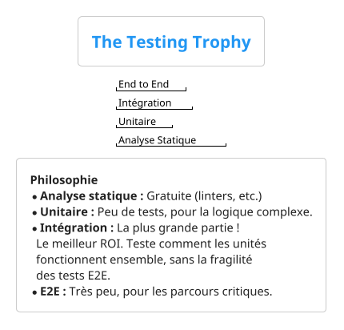

# Chapitre 1 : Au-delà des Fondations : Culture et Stratégies de Test (Pour aller plus loin)

### Objectifs pédagogiques

À la fin de cette partie, vous serez en mesure de :

- **Distinguer** finement les approches TDD (Test-Driven Development) et BDD (Behavior-Driven Development).
- **Expliquer** et **promouvoir** le concept de "Shift Left Testing".
- **Comparer** la pyramide des tests avec des modèles alternatifs comme le "Testing Trophy".
- **Identifier** différentes catégories de tests non fonctionnels et leur pertinence.
- **Comprendre** l'importance d'une culture de la qualité au sein d'une équipe.

### Introduction : De la technique à la stratégie

Dans la partie précédente, nous avons posé les fondations solides : le "pourquoi" et le "quoi" des tests. Vous avez
assimilé la pyramide, les principes FIRST et l'impact économique de la qualité. C'est comme apprendre les règles du jeu.

Maintenant, nous allons apprendre à devenir de véritables stratèges. Il ne suffit pas de savoir *comment* tester ; il
faut savoir *quoi* tester, *quand* le tester, et *comment* en parler. Nous allons aborder des concepts qui transforment
la façon dont une équipe entière collabore pour construire un produit robuste. Oubliez la vision du test comme une
simple tâche de développeur solitaire. Voyez-le comme une conversation, une philosophie qui imprègne tout le cycle de
vie du projet.

### TDD vs. BDD : Une Différence de Perspective

Vous avez déjà entendu parler de TDD et BDD. Ils sont souvent mentionnés ensemble, mais ils ne répondent pas exactement
à la même question.

<tabs>
<tab title="TDD (Test-Driven Development)">
    
<b>La Question :</b> "Comment dois-je construire ce morceau de code pour qu'il soit correct et bien conçu ?"

    
Le TDD est une <b>discipline de développement</b>, une boucle de travail pour le développeur. C'est une conversation technique que le développeur a avec lui-même pour s'assurer que le code qu'il écrit est testable et répond à une spécification technique précise.

    
Le cycle <b>Red-Green-Refactor</b> est son moteur :

    <ol>
        <li><b>Red :</b> Écrire un test unitaire qui échoue. Ce test définit ce que vous voulez accomplir.</li>
        <li><b>Green :</b> Écrire le code le plus simple possible pour que ce test passe.</li>
        <li><b>Refactor :</b> Améliorer la structure du code (le rendre plus propre, plus lisible) sans changer son comportement, en s'assurant que le test reste au vert.</li>
    </ol>
    
Le TDD est centré sur le <b>développeur</b> et la <b>conception interne</b> du logiciel.

</tab>
<tab title="BDD (Behavior-Driven Development)">
    
<b>La Question :</b> "Sommes-nous en train de construire la bonne chose ?"

    
Le BDD est un <b>processus de collaboration</b>. C'est une conversation entre les développeurs, les testeurs (QA), et les experts métier (Product Owners) pour s'assurer que tout le monde a une compréhension partagée du comportement attendu du logiciel du point de vue de l'utilisateur.

    
Le BDD utilise un langage structuré, quasi naturel, appelé <b>Gherkin</b>, avec la syntaxe <code>Given-When-Then</code> (Étant donné-Quand-Alors).

    
<b>Exemple :</b> Pour une fonctionnalité de retrait d'argent.

<b>Fonctionnalité:</b> Retrait d'argent depuis un distributeur

<b>Scénario: </b> Le compte est suffisamment approvisionné  
  <b>Étant donné que</b> le solde de mon compte est de 100€
  <b>Et que</b> le distributeur contient de l'argent
  <b>Quand</b> je demande 20€
  <b>Alors</b> le distributeur doit me donner 20€
  <b>Et</b> le solde de mon compte doit être de 80€

Ces scénarios sont la "source de vérité". Ils peuvent ensuite être automatisés pour devenir des tests (souvent d'intégration ou E2E).

Le BDD est centré sur la <b>collaboration</b> et le <b>comportement externe</b> de l'application.

</tab>
</tabs>

<tip>
Le TDD et le BDD ne s'opposent pas, ils se complètent ! Le BDD aide à définir le *quoi* (le comportement attendu), et le TDD aide à construire le *comment* (l'implémentation technique) de manière propre et robuste.
</tip>

### "Shift Left" : Tester Plus Tôt, Tester Mieux

Le "Shift Left" (décalage à gauche) est une idée simple, mais révolutionnaire. Si vous imaginez la ligne de temps d'un
projet de gauche (conception) à droite (production), le "Shift Left" consiste à **déplacer les activités de test le plus
tôt possible dans le processus**.

Pourquoi faire cela ? On revient au coût de la non-qualité :

- Un défaut dans les spécifications trouvé pendant la phase de conception coûte **1€** à corriger.
- Le même défaut trouvé par le développeur pendant le codage coûte **10€**.
- Trouvé en phase de test QA, il coûte **100€**.
- Trouvé en production par le client, il coûte **1000€**.

**Concrètement, "Shifter à Gauche" c'est :**

- Discuter des critères d'acceptation (BDD) avant d'écrire la moindre ligne de code.
- Faire des revues de code systématiques (peer reviews).
- Utiliser des outils d'analyse statique de code qui signalent les problèmes pendant que vous tapez.
- Pratiquer le TDD.

### Au-delà de la Pyramide : Le Trophée des Tests (The Testing Trophy)

La pyramide des tests est un modèle fantastique, mais le développement logiciel évolue. Pour les applications modernes,
notamment les microservices qui communiquent beaucoup entre eux, un autre modèle gagne en popularité : le **Testing
Trophy**, popularisé par Kent C. Dodds.

Il rééquilibre l'importance des différents types de tests en se basant sur le retour sur investissement.

La différence majeure est le poids accordé aux **tests d'intégration**. La philosophie derrière le trophée est : "Plus
vos tests ressemblent à la façon dont votre logiciel est utilisé, plus ils vous donneront confiance."

Les tests d'intégration (par exemple, tester un contrôleur Spring qui appelle un service et interagit avec une base de
données en mémoire) offrent un excellent compromis :

- Ils valident la collaboration de plusieurs unités, ce qui est très proche d'un cas d'usage réel.
- Ils sont beaucoup plus rapides et stables que les tests E2E.

Ce modèle ne remplace pas la pyramide, il offre une perspective différente, particulièrement pertinente pour les
applications orientées services.

### Un Vaste Monde : Les Tests Non Fonctionnels

Jusqu'à présent, nous avons surtout parlé de **tests fonctionnels** : est-ce que l'application fait ce qu'elle est
censée faire ? Mais il y a tout un univers de tests qui répondent à une autre question : *comment* le fait-elle ? Ce
sont les tests non fonctionnels.

En voici un aperçu :

- **Tests de Performance :** Votre application peut-elle gérer 1000 utilisateurs simultanés ? Le temps de réponse
  reste-t-il acceptable en charge ? (Outils : JMeter, Gatling)
- **Tests de Sécurité :** Votre application est-elle vulnérable aux attaques courantes (injection SQL, XSS) ? La gestion
  des droits est-elle fiable ? (Outils : OWASP ZAP, tests de pénétration)
- **Tests d'Utilisabilité (Usability) :** L'interface est-elle intuitive ? L'utilisateur trouve-t-il facilement ce qu'il
  cherche ? (Méthode : sessions utilisateurs, A/B testing)
- **Tests de Compatibilité :** Votre site web s'affiche-t-il correctement sur Chrome, Firefox et Safari ? Sur mobile et
  sur ordinateur ?

En tant que développeur, vous serez surtout concentré sur les tests fonctionnels, mais il est crucial de savoir que ces
autres dimensions de la qualité existent et sont vitales pour le succès d'un produit.

### Exercice 2 : Défendre une stratégie de test

Imaginez la situation suivante : vous rejoignez un nouveau projet. Le chef de projet, bien intentionné mais peu
technique, déclare lors de la première réunion : "Pour ce projet, la qualité est notre priorité absolue. J'exige donc
que nous ayons une couverture de code (code coverage) de 100% sur l'ensemble de l'application."

En vous basant sur tous les concepts vus dans ce chapitre (pyramide, trophée, coût, TDD/BDD, etc.), rédigez en quelques
points l'argumentaire que vous présenteriez calmement à votre chef de projet pour proposer une stratégie de test plus
nuancée et efficace.

### Correction exercice 2 {collapsible="true"}

Voici un exemple d'argumentaire structuré et professionnel :

**Objectif :** Aligner notre stratégie de test sur la valeur métier et l'efficacité, plutôt que sur une métrique unique.

**Mon argumentaire :**

1. **Reconnaître l'intention positive :** "Je suis tout à fait d'accord sur le fait que la qualité est notre priorité,
   et je trouve super que nous ayons cette ambition dès le début. L'idée de mesurer notre qualité est excellente."

2. **Expliquer les limites du "100% coverage" :**
    * **Qualité vs. Quantité :** "Une couverture de 100% garantit que chaque ligne de code est *exécutée* par un test,
      mais pas qu'elle est *correctement testée*. On peut avoir 100% de couverture avec des tests qui ne vérifient rien
      d'utile. Notre but devrait être d'avoir des tests *pertinents* plutôt que simplement *nombreux*."
    * **Retour sur Investissement Décroissant :** "Comme le suggère la pyramide des tests, atteindre les derniers
      pourcentages de couverture (par exemple, de 95% à 100%) a un coût de développement très élevé pour un gain de
      confiance très faible. On passerait du temps à tester du code trivial (comme de simples accesseurs) au lieu de se
      concentrer sur la logique métier complexe."

3. **Proposer une stratégie alternative et constructive :**
    * **Focalisons-nous sur la confiance (Testing Trophy) :** "Je propose que nous nous concentrions sur le retour sur
      investissement de nos tests. Nous devrions avoir une excellente couverture de notre logique métier critique avec
      des **tests unitaires** rapides. Mais surtout, nous devrions investir dans des **tests d'intégration** qui
      valident nos fonctionnalités clés de bout en bout (par exemple, de l'API à la base de données). Ces tests nous
      donneront une confiance beaucoup plus élevée qu'une simple métrique de couverture."
    * **Utilisons la couverture comme un guide :** "La couverture de code reste un outil formidable ! Au lieu de la voir
      comme un objectif à atteindre, utilisons-la comme un **radar pour détecter les zones non testées**. Si nous voyons
      qu'un module métier important n'est pas du tout couvert, c'est une alerte. C'est un outil d'exploration, pas un
      juge."
    * **Intégrons la qualité en amont (Shift Left & BDD) :** "Pour garantir la qualité, la meilleure stratégie est de la
      construire dès le départ. En utilisant des approches comme le BDD pour définir clairement nos besoins et le TDD
      pour les implémenter, nous réduirons le nombre de bugs nativement. La qualité sera intégrée, pas juste vérifiée à
      la fin."

**Conclusion de la proposition :** "En résumé, au lieu de viser 100% de couverture, je propose que nous visions **100%
de confiance sur nos fonctionnalités critiques**, en utilisant un mélange intelligent de tests unitaires, d'intégration,
et en utilisant la couverture comme un outil d'amélioration continue."

### Auto-évaluation

Testez votre compréhension de ces concepts stratégiques.

1. (Question ouverte) Qu'est-ce que le "Shift Left Testing" ? Donnez un exemple concret d'activité qui en relève.
2. (QCM) Lequel de ces modèles de test accorde le plus d'importance relative aux tests d'intégration ?
    * a) La Pyramide des Tests
    * b) Le Modèle en V
    * c) Le Trophée des Tests (Testing Trophy)
    * d) Le Test Manuel
3. (Question ouverte) Quelle est la principale différence de "public" ou d'"audience" entre le TDD et le BDD ?
4. (QCM) Lequel des tests suivants est un exemple de test non fonctionnel ?
    * a) Un test qui vérifie que l'ajout d'un produit au panier met à jour le total.
    * b) Un test qui vérifie qu'un utilisateur non-administrateur ne peut pas accéder au panel d'administration.
    * c) Un test qui mesure le temps de réponse de la page d'accueil avec 500 utilisateurs connectés.
    * d) Un test qui valide le format d'une adresse e-mail.
5. (QCM) La syntaxe `Given-When-Then` est principalement associée à :
    * a) TDD (Test-Driven Development)
    * b) La programmation orientée objet
    * c) BDD (Behavior-Driven Development)
    * d) L'analyse statique de code

*(Les corrections de l'auto-évaluation seront fournies à la toute fin du support de cours.)*

### Conclusion de la partie

Vous avez maintenant une vision beaucoup plus stratégique et nuancée des tests logiciels. Vous savez que la qualité
n'est pas qu'une question technique, mais aussi une question de collaboration (BDD), de processus (Shift Left) et de
stratégie adaptée au contexte (Pyramide vs. Trophée). Vous êtes armé non seulement pour écrire des tests, mais aussi
pour participer à des conversations importantes sur la stratégie de qualité de votre projet.

Avec cette base théorique et stratégique complète, nous sommes fin prêts à plonger dans la pratique. Dans le prochain
chapitre, nous allons mettre les mains dans le cambouis. Nous installerons les outils essentiels que sont **JUnit 5** et
**Mockito** et nous écrirons nos tout premiers tests unitaires en Java. L'aventure ne fait que commencer 