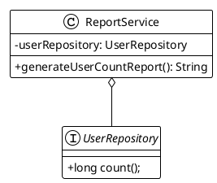

# Chapitre 2 : Les Outils Essentiels du Testeur Java (L'essentiel)

### Objectifs pédagogiques

À la fin de cette partie, vous serez capable de :

- **Écrire** un test unitaire de base en utilisant JUnit 5.
- **Maîtriser** le cycle de vie d'un test avec les annotations `@BeforeEach`, `@AfterEach`, etc.
- **Isoler** votre code en créant des "mocks" avec Mockito pour simuler les dépendances.
- **Rédiger** des assertions claires, lisibles et puissantes grâce à AssertJ.
- **Éviter** la duplication de code dans vos tests grâce aux tests paramétrés.

### Introduction : Votre première caisse à outils

Imaginez que vous deviez construire une maison. Dans le premier chapitre, nous avons étudié les plans (la pyramide), les
règles de sécurité (les principes FIRST) et la philosophie du chantier (l'agilité). C'est indispensable, mais pour
l'instant, vous n'avez aucun outil dans les mains. Impossible de planter le moindre clou.

Ce chapitre vous livre votre première caisse à outils de développeur professionnel. Nous n'allons pas découvrir des
dizaines d'outils compliqués, mais trois outils fondamentaux, polyvalents et incroyablement puissants :

- **JUnit 5 :** Votre établi et votre terrain de jeu. C'est le framework qui exécute vos tests, les organise et vous
  donne les résultats.
- **Mockito :** Votre maître de l'illusion. C'est la bibliothèque qui vous permet de créer des faux objets (des "mocks")
  pour isoler parfaitement le code que vous voulez tester.
- **AssertJ :** Votre instrument de mesure de précision. C'est la bibliothèque qui vous permet de vérifier les résultats
  de vos tests de manière fluide et expressive.

Ensemble, ils forment le trio gagnant du test en Java. Préparez-vous à les installer et à les utiliser pour la première
fois.

### JUnit 5 : Votre Terrain de Jeu pour les Tests

JUnit est LE standard de facto pour les tests en Java. La version 5 (surnommée Jupiter) est moderne, flexible et très
agréable à utiliser.

#### Votre premier test : `@Test`

Tout commence par l'annotation `@Test`. Elle signale à JUnit qu'une méthode est une méthode de test et qu'elle doit être
exécutée.

Prenons une classe métier très simple, un calculateur.

```java
// Fichier : fr/formation/spring/test/Calculator.java
package fr.formation.spring.test;

public class Calculator {
    // Une méthode simple qui additionne deux entiers.
    public int add(int a, int b) {
        return a + b;
    }
}
```

Maintenant, écrivons un test pour cette classe. Par convention, si la classe s'appelle `Calculator`, la classe de test
s'appellera `CalculatorTest`.

```java
// Fichier : src/test/java/fr/formation/spring/test/CalculatorTest.java
package fr.formation.spring.test;

import org.junit.jupiter.api.Assertions;
import org.junit.jupiter.api.DisplayName;
import org.junit.jupiter.api.Test;

class CalculatorTest {

    @Test
    // Cette annotation rend le nom du test plus lisible dans les rapports.
    @DisplayName("Devrait retourner 5 quand on additionne 2 et 3")
    void shouldReturn5_whenAdding2And3() {
        // Arrange : Préparer les objets et les données nécessaires.
        Calculator calculator = new Calculator();
        int a = 2;
        int b = 3;

        // Act : Appeler la méthode que l'on veut tester.
        int result = calculator.add(a, b);

        // Assert : Vérifier que le résultat est bien celui attendu.
        Assertions.assertEquals(5, result, "Le résultat de 2+3 devrait être 5");
    }
}
```

<tip>
La structure **Arrange-Act-Assert** (ou Given-When-Then en BDD) est une convention très forte. Elle rend vos tests incroyablement lisibles :
1.  **Arrange** : Je mets en place les conditions du test.
2.  **Act** : J'exécute l'action à tester.
3.  **Assert** : Je vérifie le résultat.
</tip>

#### Le cycle de vie d'un test

Parfois, vous avez besoin de préparer un environnement avant chaque test (par exemple, créer une nouvelle instance d'un
objet) et de le nettoyer après. JUnit vous offre des annotations pour gérer ce cycle de vie.

<procedure title="Annotations de Cycle de Vie">
<p>Imaginez que vous préparez votre plan de travail :</p>
    <step><code>@BeforeAll</code> : Une méthode statique exécutée <b>une seule fois</b> avant tous les tests de la classe. (Ex: Démarrer une connexion à une base de données de test).</step>
    <step><code>@BeforeEach</code> : Exécutée <b>avant chaque</b> méthode <code>@Test</code>. (Ex: Créer une nouvelle instance de la classe à tester pour garantir l'isolation).</step>
    <step><code>@Test</code> : Votre test.</step>
    <step><code>@AfterEach</code> : Exécutée <b>après chaque</b> méthode <code>@Test</code>. (Ex: Nettoyer des fichiers temporaires).</step>
    <step><code>@AfterAll</code> : Une méthode statique exécutée <b>une seule fois</b> après tous les tests de la classe. (Ex: Fermer la connexion à la base de données).</step>
</procedure>

#### Tester les erreurs avec `assertThrows`

Un bon test ne vérifie pas que le cas "heureux". Il vérifie aussi que votre code réagit correctement en cas d'erreur,
par exemple en lançant une exception.

```java
// Ajoutons une méthode de division à notre Calculator
public double divide(int a, int b) {
    if (b == 0) {
        throw new IllegalArgumentException("Le diviseur ne peut pas être zéro");
    }
    return (double) a / b;
}

// Et le test correspondant
@Test
@DisplayName("Devrait lancer une exception quand on divise par zéro")
void shouldThrowException_whenDividingByZero() {
    Calculator calculator = new Calculator();

    // Assert : On vérifie qu'un appel à calculator.divide(10, 0)
    // lance bien une exception de type IllegalArgumentException.
    Assertions.assertThrows(IllegalArgumentException.class, () -> {
        calculator.divide(10, 0);
    });
}
```

#### Tests paramétrés : Ne vous répétez pas !

Imaginons que vous vouliez tester plusieurs cas pour la méthode `add`. Au lieu d'écrire 3 tests quasi identiques, vous
pouvez écrire un seul test "paramétré".

```java
import org.junit.jupiter.params.ParameterizedTest;
import org.junit.jupiter.params.provider.CsvSource;

// ... dans la classe CalculatorTest

@ParameterizedTest
// Chaque chaîne est un jeu de données : 'input1, input2, expectedResult'
@CsvSource({
        "1, 1, 2",
        "5, 5, 10",
        "-1, 1, 0",
        "100, 200, 300"
})
@DisplayName("Additionne correctement plusieurs jeux de données")
void shouldAddCorrectly_forMultipleValues(int a, int b, int expected) {
    Calculator calculator = new Calculator();
    int result = calculator.add(a, b);
    Assertions.assertEquals(expected, result);
}
```

### Mockito : L'Art de l'Illusion pour des Tests Unitaires Purs

Le but d'un test unitaire est de tester une classe en **total isolation**. Mais que faire si votre classe dépend d'une
autre, comme un service qui dépend d'un repository pour accéder à la base de données ? Vous ne voulez pas dépendre d'une
vraie base de données pour un test unitaire. C'est là que Mockito entre en scène.

Mockito vous permet de créer une version "factice" de la dépendance, un **mock**.

Imaginons un service qui génère un rapport sur le nombre d'utilisateurs.



```java
// Fichier : fr/formation/spring/test/UserRepository.java
package fr.formation.spring.test;

public interface UserRepository {
    long count(); // Simule un appel à la base de données
}
```

```java
// Fichier : fr/formation/spring/test/ReportService.java
package fr.formation.spring.test;

public class ReportService {
    private final UserRepository userRepository;

    public ReportService(UserRepository userRepository) {
        this.userRepository = userRepository;
    }

    // La logique métier que nous voulons tester.
    public String generateUserCountReport() {
        long userCount = this.userRepository.count();
        if (userCount == 0) {
            return "Aucun utilisateur trouvé.";
        }
        return "Nombre d'utilisateurs : " + userCount;
    }
}
```

Pour tester `ReportService`, nous devons **mocker** `UserRepository`.

```java
// Fichier : src/test/java/fr/formation/spring/test/ReportServiceTest.java
package fr.formation.spring.test;

import org.junit.jupiter.api.Test;
import org.junit.jupiter.api.extension.ExtendWith;
import org.mockito.InjectMocks;
import org.mockito.Mock;
import org.mockito.junit.jupiter.MockitoExtension;

import static org.junit.jupiter.api.Assertions.assertEquals;
import static org.mockito.Mockito.when;
import static org.mockito.Mockito.verify;
import static org.mockito.Mockito.times;

// Active l'intégration de Mockito avec JUnit 5
@ExtendWith(MockitoExtension.class)
class ReportServiceTest {

    @Mock // Demande à Mockito de créer un mock de cette interface
    private UserRepository mockUserRepository;

    @InjectMocks // Crée une instance de ReportService et y injecte les mocks
    private ReportService reportService;

    @Test
    void shouldReturnReport_whenUsersExist() {
        // Arrange : On dit au mock comment se comporter.
        // "QUAND la méthode count() est appelée, ALORS retourne 50"
        when(mockUserRepository.count()).thenReturn(50L);

        // Act : On appelle la méthode à tester.
        String report = reportService.generateUserCountReport();

        // Assert : On vérifie que le résultat est correct.
        assertEquals("Nombre d'utilisateurs : 50", report);

        // Verify (Optionnel mais puissant) : On vérifie que la méthode count()
        // a bien été appelée sur notre mock, exactement 1 fois.
        verify(mockUserRepository, times(1)).count();
    }
}
```

### AssertJ : Écrire des Tests qui se Lisent comme des Phrases

Les assertions de base de JUnit sont fonctionnelles. Mais AssertJ les rend **fluides**, plus lisibles et plus
puissantes.

Le principe est simple : toute assertion commence par `assertThat(valeur_reelle)` et est suivie par une ou plusieurs
conditions qui se lisent comme de l'anglais.

<tabs>
<tab title="Comparaison JUnit vs. AssertJ">

| Cas de Test                       | Assertion JUnit                      | Assertion AssertJ (plus lisible)                                      |
|-----------------------------------|--------------------------------------|-----------------------------------------------------------------------|
| Égalité simple                    | `assertEquals(5, result);`           | `assertThat(result).isEqualTo(5);`                                    |
| Vrai/Faux                         | `assertTrue(isValid);`               | `assertThat(isValid).isTrue();`                                       |
| Nullité                           | `assertNull(user);`                  | `assertThat(user).isNull();`                                          |
| Contenu d'une liste               | `assertTrue(list.contains("Java"));` | `assertThat(list).contains("Java");`                                  |
| Taille d'une liste                | `assertEquals(3, list.size());`      | `assertThat(list).hasSize(3);`                                        |
| **Chaînage (la vraie puissance)** | *Difficile à faire en une ligne*     | `assertThat(list).hasSize(3).contains("Java").doesNotContain("C++");` |

</tab>
</tabs>

<warning>
Spring Boot inclut AssertJ par défaut dans son `spring-boot-starter-test`. Vous n'avez même pas à l'ajouter. Il est fortement recommandé de l'utiliser systématiquement pour la clarté de vos tests.
</warning>

### Exercice 3 : Mettre en pratique le trio JUnit, Mockito & AssertJ

Vous devez tester un `InvoiceService` qui calcule le montant total d'une facture. La règle métier est la suivante : si
le montant total des produits dépasse 100€, une réduction de 10% est appliquée.

Voici le code de départ :

```java
// Fichier : fr/formation/spring/test/model/Product.java
package fr.formation.spring.test.model;

public class Product {
    private String id;
    private double price;
    // ... constructeurs, getters
}
```


```java
// Fichier : fr.formation.spring.test.repository.ProductRepository.java
package fr.formation.spring.test.repository;

import fr.formation.spring.test.model.Product;
import java.util.List;
import java.util.Set;

public interface ProductRepository {
    // Trouve des produits par leurs IDs
    List<Product> findAllById(Set<String> ids);
}
```


```java
// Fichier : fr.formation.spring.test.service.InvoiceService.java
package fr.formation.spring.test.service;

import fr.formation.spring.test.model.Product;
import fr.formation.spring.test.repository.ProductRepository;
import java.util.List;
import java.util.Set;

public class InvoiceService {
    private final ProductRepository productRepository;
    private static final double DISCOUNT_THRESHOLD = 100.0;
    private static final double DISCOUNT_RATE = 0.90; // 10% de réduction

    public InvoiceService(ProductRepository productRepository) {
        this.productRepository = productRepository;
    }

    public double calculateTotalAmount(Set<String> productIds) {
        List<Product> products = productRepository.findAllById(productIds);
        double total = products.stream().mapToDouble(Product::getPrice).sum();

        if (total > DISCOUNT_THRESHOLD) {
            total *= DISCOUNT_RATE;
        }
        return total;
    }
}
```

**Votre mission :**
Écrivez une classe de test `InvoiceServiceTest` avec une méthode qui teste le cas où la réduction de 10% est appliquée.
Utilisez JUnit pour la structure, Mockito pour mocker le `ProductRepository`, et AssertJ pour les assertions.

### Correction exercice 3 {collapsible="true"}

```java
// Fichier : src/test/java/fr/formation/spring/test/service/InvoiceServiceTest.java
package fr.formation.spring.test.service;

import fr.formation.spring.test.model.Product;
import fr.formation.spring.test.repository.ProductRepository;
import org.junit.jupiter.api.DisplayName;
import org.junit.jupiter.api.Test;
import org.junit.jupiter.api.extension.ExtendWith;
import org.mockito.InjectMocks;
import org.mockito.Mock;
import org.mockito.junit.jupiter.MockitoExtension;

import java.util.List;
import java.util.Set;

import static org.assertj.core.api.Assertions.assertThat;
import static org.assertj.core.api.Assertions.within;
import static org.mockito.Mockito.when;
import static org.mockito.Mockito.verify;

@ExtendWith(MockitoExtension.class)
class InvoiceServiceTest {

    @Mock
    private ProductRepository productRepository;

    @InjectMocks
    private InvoiceService invoiceService;

    @Test
    @DisplayName("Devrait appliquer une réduction de 10% si le total dépasse 100€")
    void shouldApplyDiscount_whenTotalIsOver100() {
        // Arrange : Préparation des données et du comportement du mock
        Product product1 = new Product("p1", 80.0);
        Product product2 = new Product("p2", 70.0);
        // Le total (150€) est supérieur au seuil de 100€

        Set<String> productIds = Set.of("p1", "p2");
        List<Product> productsFromRepo = List.of(product1, product2);

        // On configure le mock : quand findAllById est appelé avec ce Set...
        when(productRepository.findAllById(productIds))
                .thenReturn(productsFromRepo); // ...il doit retourner cette liste.

        // Act : Appel de la méthode à tester
        double finalAmount = invoiceService.calculateTotalAmount(productIds);

        // Assert : Vérification avec AssertJ
        // 150 * 0.90 = 135
        assertThat(finalAmount)
                .isCloseTo(135.0, within(0.01)); // Préférable pour les doubles

        // Verify : On s'assure que le repository a bien été appelé
        verify(productRepository).findAllById(productIds);
    }
}
```

### Auto-évaluation

1. (Question ouverte) À quoi sert l'annotation `@BeforeEach` dans un test JUnit ?
2. (QCM) Dans le contexte de Mockito, qu'est-ce qu'un "mock" ?
    * a) Une version réelle d'une dépendance.
    * b) Un objet factice qui simule le comportement d'une dépendance pour isoler le code testé.
    * c) Une annotation pour marquer un test comme étant lent.
    * d) Une erreur dans un test.
3. (Question ouverte) Quel est le principal avantage d'utiliser AssertJ par rapport aux assertions standards de JUnit ?
4. (QCM) Quelle annotation utiliser pour créer un test qui s'exécute avec plusieurs jeux de données différents ?
    * a) `@Test`
    * b) `@RepeatedTest`
    * c) `@DisplayName`
    * d) `@ParameterizedTest`
5. (QCM) Quelle est la syntaxe correcte pour "stuber" (définir le comportement) d'une méthode avec Mockito ?
    * a) `mock.method().returns("value")`
    * b) `when(mock.method()).thenReturn("value")`
    * c) `given(mock.method()).is("value")`
    * d) `let(mock.method()).be("value")`

*(Les corrections de l'auto-évaluation seront fournies à la toute fin du support de cours.)*

### Conclusion de la partie

Vous venez de faire un grand pas ! Vous n'êtes plus un simple spectateur, vous êtes un acteur du test. Vous avez en main
les trois outils fondamentaux qui vous serviront tout au long de votre carrière : **JUnit** pour la structure, **Mockito
** pour l'isolation et **AssertJ** pour la vérification. Vous avez vu comment ils s'articulent pour créer des tests
unitaires robustes, lisibles et efficaces.

Dans la partie "Pour aller plus loin", nous explorerons des fonctionnalités avancées de ces outils. Mais le plus
excitant arrive ensuite : dans le prochain chapitre, nous verrons comment le framework Spring Boot prend ces outils et
les intègre de manière transparente, nous offrant des super-pouvoirs pour tester nos applications de manière encore plus
simple et puissante.