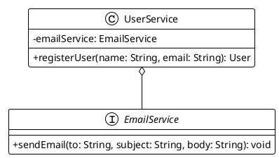

# Chapitre 2 : Maîtriser Votre Boîte à Outils de Test (Pour aller plus loin)

### Objectifs pédagogiques

À la fin de cette partie, vous serez capable de :

- **Structurer** des tests complexes de manière lisible avec les classes imbriquées (`@Nested`).
- **Capturer** et **inspecter** les arguments passés à vos mocks avec `ArgumentCaptor`.
- **Tester** des méthodes `void` et manipuler des espions (`@Spy`) avec Mockito.
- **Valider** plusieurs propriétés d'un objet en une seule fois grâce aux "soft assertions" d'AssertJ.
- **Rédiger** des assertions puissantes sur des collections d'objets.

### Introduction : De l'artisan à l'artiste

Dans la partie précédente, vous avez reçu votre caisse à outils de base. Vous savez planter un clou avec JUnit, couper
une planche avec Mockito et mesurer un angle avec AssertJ. Vous pouvez déjà construire des choses solides.

Maintenant, nous allons équiper ces outils d'accessoires de précision. Nous allons apprendre les techniques qui
permettent de réaliser des finitions parfaites, de sculpter des détails complexes et de travailler plus efficacement.
C'est la différence entre un artisan qui assemble et un artiste qui crée. Ces techniques avancées vous permettront de
tester des scénarios qui vous semblaient hors de portée, tout en gardant vos tests clairs, concis et extrêmement
puissants.

### JUnit 5 : Organiser et Dynamiser Vos Scénarios

#### Organiser avec `@Nested`

Quand une classe à tester a plusieurs méthodes ou des comportements complexes, votre classe de test peut vite devenir un
fichier énorme et illisible. JUnit 5 propose une solution élégante : l'annotation `@Nested`. Elle vous permet de créer
des classes internes qui regroupent des tests par contexte ou par fonctionnalité.

Imaginez une classe `UserAccount` avec des méthodes pour le dépôt, le retrait, et la fermeture de compte.

```java
// Dans UserAccountTest.java
class UserAccountTest {

    @Nested
    @DisplayName("Tests pour les dépôts")
    class DepositTests {
        @Test
        void shouldIncreaseBalance_whenDepositingPositiveAmount() { /* ... */ }

        @Test
        void shouldThrowException_whenDepositingNegativeAmount() { /* ... */ }
    }

    @Nested
    @DisplayName("Tests pour les retraits")
    class WithdrawalTests {
        @Test
        void shouldDecreaseBalance_whenSufficientFunds() { /* ... */ }

        @Test
        void shouldThrowException_whenInsufficientFunds() { /* ... */ }
    }
}
```

<tip>
L'utilisation de `@Nested` améliore drastiquement la lisibilité. Chaque classe imbriquée peut avoir son propre cycle de vie (`@BeforeEach`, etc.), vous permettant de créer des setups très spécifiques pour chaque groupe de tests.
</tip>

### Mockito : Au-delà du Simple `thenReturn`

#### Tester les méthodes `void` et la famille `do...when`

Que se passe-t-il si la méthode que vous voulez tester ne retourne rien (`void`) ? Vous ne pouvez pas utiliser
`when(mock.method()).thenReturn(...)`.

C'est là qu'intervient la famille de méthodes `do...`.

- `doNothing()`: Ne fait rien quand une méthode `void` est appelée.
- `doThrow()`: Lance une exception quand une méthode (y compris `void`) est appelée.
- `doAnswer()`: Permet de fournir une logique de réponse complexe.

La syntaxe est inversée : `do...().when(mock).method(...)`.

```java
// Imaginons un mock de service de logging
LoggerService mockLogger = mock(LoggerService.class);

// Configure le mock pour ne rien faire quand log() est appelée.
// Utile pour s'assurer qu'aucune exception n'est lancée.
doNothing().
        .when(mockLogger)
        .log(anyString());

// Configure le mock pour lancer une exception.
doThrow(new IOException("Disk full"))
        .when(mockLogger).log(anyString());
```

#### Capturer des arguments avec `ArgumentCaptor`

C'est l'une des techniques les plus puissantes de Mockito. Parfois, vous ne voulez pas seulement vérifier qu'une méthode
a été appelée, mais vous voulez **inspecter la valeur qui lui a été passée en argument**.

Imaginons un `UserService` qui, après avoir créé un utilisateur, envoie un email de bienvenue via un `EmailService`.



Comment tester que l'email envoyé contient bien le nom du nouvel utilisateur ?

```java

@ExtendWith(MockitoExtension.class)
class UserServiceTest {
    @Mock
    private EmailService mockEmailService;

    @InjectMocks
    private UserService userService;

    @Test
    void shouldSendWelcomeEmail_withCorrectUserName() {
        // Arrange
        // On crée un "piège" pour capturer un argument de type String
        ArgumentCaptor<String> bodyCaptor =
                ArgumentCaptor.forClass(String.class);

        // Act
        userService.registerUser("Alex", "alex@example.com");

        // Verify & Capture
        // On vérifie que sendEmail a été appelé et on capture l'argument 'body'
        verify(mockEmailService).sendEmail(
                eq("alex@example.com"),
                anyString(),
                bodyCaptor.capture() // Le piège est posé ici
        );

        // Assert
        // On récupère la valeur capturée et on l'inspecte
        String emailBody = bodyCaptor.getValue();
        assertThat(emailBody).contains("Bienvenue Alex !");
    }
}
```

#### Les espions (`@Spy`) : Mocker avec parcimonie

Un `@Mock` est un objet entièrement factice. Chaque méthode ne fait rien par défaut. Un `@Spy` est différent : c'est un
**objet réel** que l'on "espionne". Par défaut, **toutes les méthodes originales sont appelées**, sauf si vous en
décidez autrement.

<warning>
**Quand utiliser un Spy ?** Très rarement ! Un spy est utile quand vous voulez tester une méthode d'une classe, tout en utilisant le comportement réel des autres méthodes de cette même classe. C'est souvent le signe d'une classe qui a trop de responsabilités et qui devrait être refactorisée.
</warning>

```java
// Création d'un spy sur un objet réel
List<String> realList = new ArrayList<>();
List<String> spyList = spy(realList);

// On appelle une méthode NON stubbée : la vraie méthode est appelée.
spyList.add("one");

assertThat(spyList.get(0)).isEqualTo("one");

// On stubbe une méthode spécifique.
when(spyList.size()).thenReturn(100); // Attention à la syntaxe

// Maintenant, seul l'appel à size() est "mocké".
assertThat(spyList.size()).isEqualTo(100);
```

### AssertJ : Des Assertions Chirurgicales

AssertJ brille vraiment quand vous devez faire des assertions complexes.

#### Assertions sur les collections

Inspecter des listes ou des ensembles devient un jeu d'enfant.

```java
List<Product> products = List.of(
        new Product("p1", "Laptop", 1200.0),
        new Product("p2", "Mouse", 25.0),
        new Product("p3", "Keyboard", 75.0)
);

// Extraire une propriété et faire une assertion dessus
assertThat(products)
    .extracting(Product::getName) // Extrait les noms
    .contains("Mouse","Laptop")
    .doesNotContain("Webcam");

// Vérifier que tous les éléments satisfont une condition
assertThat(products)
        .allMatch(p ->p
        .getPrice() >0,"le prix doit être positif");

// Vérifier une condition pour un seul élément (avec description)
assertThat(products)
    .anySatisfy(p ->{
        assertThat(p.getName()).isEqualTo("Laptop");
        assertThat(p.getPrice()).isCloseTo(1200.0,within(0.01));
    });
```

#### Soft Assertions : Ne pas s'arrêter au premier échec

Par défaut, un test s'arrête à la première assertion qui échoue. C'est frustrant quand on valide un objet avec plusieurs
propriétés. Les "soft assertions" collectent toutes les erreurs et les rapportent à la fin.

```java
// Dans la classe de test

import org.assertj.core.api.SoftAssertions;
// ...

@Test
void userObjectShouldBeCorrectlyPopulated() {
    User user = userService.findById("user-123");

    SoftAssertions.assertSoftly(softly -> {
        softly.assertThat(user.getFirstName()).isEqualTo("John"); // Supposons que c'est "Jon"
        softly.assertThat(user.getLastName()).isEqualTo("Doe");
        softly.assertThat(user.getAge()).isEqualTo(30); // Supposons que c'est 31
        softly.assertThat(user.isActive()).isTrue();
    });
    // Le rapport de test montrera que le prénom ET l'âge sont incorrects,
    // au lieu de s'arrêter dès la première erreur sur le prénom.
}
```

### Exercice 4 : Combiner les techniques avancées

On reprend notre `InvoiceService`. On ajoute une nouvelle contrainte : après avoir calculé une facture, si celle-ci
bénéficie de la réduction, une notification doit être envoyée à un `AuditService` pour tracer l'événement. La méthode de
calcul de la facture ne retourne que le montant, elle est `void` pour la notification.

```java
// Nouveau service : fr.formation.spring.test.service.AuditService.java
package fr.formation.spring.test.service;

public interface AuditService {
    // Enregistre un événement dans un journal d'audit
    void recordDiscountEvent(String invoiceId, double amount, double discount);
}
```

```java
// InvoiceService modifié
package fr.formation.spring.test.service;

public class InvoiceService {
    // ...
    private final AuditService auditService;

    public InvoiceService(ProductRepository productRepository,
                          AuditService auditService) {
        this.productRepository = productRepository;
        this.auditService = auditService;
    }

    public double calculateTotalAmount(String invoiceId, Set<String> productIds) {
        // ... (même logique de calcul qu'avant)
        double total = /* ... */;
        double originalTotal = total;

        if (total > DISCOUNT_THRESHOLD) {
            total *= DISCOUNT_RATE;
            // Appel à l'AuditService si une réduction est appliquée
            auditService.recordDiscountEvent(
                    invoiceId, originalTotal, originalTotal - total
            );
        }
        return total;
    }
}
```

**Votre mission :**
Écrivez un test pour `calculateTotalAmount` qui vérifie le scénario où la réduction est appliquée. Ce test doit :

1. Utiliser Mockito pour mocker `ProductRepository` et `AuditService`.
2. Utiliser `ArgumentCaptor` pour capturer les 3 arguments passés à `auditService.recordDiscountEvent`.
3. Utiliser AssertJ et ses "soft assertions" pour valider que chaque argument capturé est correct.

### Correction exercice 4 {collapsible="true"}

```java
// Fichier : src/test/java/fr/formation/spring/test/service/InvoiceServiceTest.java
package fr.formation.spring.test.service;

import fr.formation.spring.test.model.Product;
import fr.formation.spring.test.repository.ProductRepository;
import org.assertj.core.api.SoftAssertions;
import org.junit.jupiter.api.DisplayName;
import org.junit.jupiter.api.Test;
import org.junit.jupiter.api.extension.ExtendWith;
import org.mockito.ArgumentCaptor;
import org.mockito.InjectMocks;
import org.mockito.Mock;
import org.mockito.junit.jupiter.MockitoExtension;

import java.util.List;
import java.util.Set;

import static org.assertj.core.api.Assertions.assertThat;
import static org.assertj.core.api.Assertions.within;
import static org.mockito.Mockito.verify;
import static org.mockito.Mockito.when;

@ExtendWith(MockitoExtension.class)
class InvoiceServiceTest {

    @Mock
    private ProductRepository productRepository;

    @Mock
    private AuditService auditService;

    @InjectMocks
    private InvoiceService invoiceService;

    // ... (le test précédent)

    @Test
    @DisplayName("Devrait notifier l'AuditService quand une réduction est appliquée")
    void shouldNotifyAuditService_whenDiscountIsApplied() {
        // Arrange
        Product p1 = new Product("p1", 100.0);
        Product p2 = new Product("p2", 100.0); // Total: 200.0
        Set<String> productIds = Set.of("p1", "p2");
        when(productRepository.findAllById(productIds)).thenReturn(List.of(p1, p2));

        ArgumentCaptor<String> idCaptor = ArgumentCaptor.forClass(String.class);
        ArgumentCaptor<Double> amountCaptor = ArgumentCaptor.forClass(Double.class);
        ArgumentCaptor<Double> discountCaptor = ArgumentCaptor.forClass(Double.class);

        // Act
        double finalAmount = invoiceService.calculateTotalAmount("INV-001", productIds);

        // Assert - partie 1 : vérifier le montant retourné
        // 200 * 0.9 = 180
        assertThat(finalAmount).isCloseTo(180.0, within(0.01));

        // Verify & Capture
        verify(auditService).recordDiscountEvent(
                idCaptor.capture(),
                amountCaptor.capture(),
                discountCaptor.capture()
        );

        // Assert - partie 2 : vérifier les arguments capturés avec Soft Assertions
        SoftAssertions.assertSoftly(softly -> {
            softly.assertThat(idCaptor.getValue())
                    .isEqualTo("INV-001");
            softly.assertThat(amountCaptor.getValue())
                    .as("Montant original avant réduction")
                    .isCloseTo(200.0, within(0.01));
            softly.assertThat(discountCaptor.getValue())
                    .as("Montant de la réduction")
                    .isCloseTo(20.0, within(0.01));
        });
    }
}
```

### Auto-évaluation

1. (Question ouverte) Dans quel cas est-il plus pertinent d'utiliser un `@Spy` plutôt qu'un `@Mock` ? Quel est le risque
   associé ?
2. (QCM) Quelle est la principale utilité de `ArgumentCaptor` ?
    * a) Capturer les exceptions lancées par un mock.
    * b) Capturer et inspecter les valeurs des arguments passés à une méthode d'un mock.
    * c) Remplacer les arguments d'un appel de méthode.
    * d) Capturer le temps d'exécution d'une méthode.
3. (Question ouverte) Expliquez l'avantage des "soft assertions" d'AssertJ lors de la validation d'un objet complexe.
4. (QCM) Pour organiser des tests en groupes contextuels au sein d'une même classe de test, on utilise :
    * a) Des packages différents.
    * b) `@TestFactory`.
    * c) Des commentaires et une bonne nomenclature.
    * d) L'annotation `@Nested` sur des classes internes.
5. (QCM) Vous voulez tester une méthode `void` qui est censée lancer une exception dans certains cas. Quelle syntaxe
   Mockito utiliserez-vous ?
    * a) `when(mock.voidMethod()).thenThrow(new MyException());`
    * b) `expect(mock.voidMethod()).toThrow(new MyException());`
    * c) `doThrow(new MyException()).when(mock).voidMethod();`
    * d) Il est impossible de tester les exceptions sur les méthodes `void`.

*(Les corrections de l'auto-évaluation seront fournies à la toute fin du support de cours.)*

### Conclusion de la partie

Félicitations ! Vous avez ajouté des outils de haute précision à votre arsenal. Vous ne vous contentez plus de vérifier
si "ça marche", vous êtes maintenant capable de disséquer le comportement de votre code. Vous savez **organiser** vos
tests (`@Nested`), **espionner** le dialogue entre vos objets (`ArgumentCaptor`), gérer les cas délicats (`do...when`)
et produire des diagnostics d'une précision chirurgicale (AssertJ avancé, Soft Assertions).

Ces compétences sont universelles dans l'écosystème Java. Elles constituent le socle sur lequel nous allons maintenant
construire. Dans le prochain chapitre, nous allons voir comment Spring Boot s'appuie sur ces outils et les sublime, en
nous offrant des annotations et des utilitaires qui simplifient radicalement les tests d'intégration. Vous êtes prêts
pour la prochaine étape : tester une véritable application Spring 