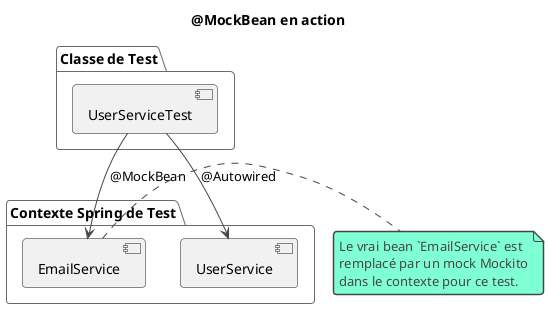

# Chapitre 3 : L'Intégration Transparente : Tester avec Spring Boot (L'essentiel)

### Objectifs pédagogiques

À la fin de cette partie, vous serez en mesure de :

- **Expliquer** le rôle du starter `spring-boot-starter-test` et les dépendances qu'il apporte.
- **Utiliser** l'annotation `@SpringBootTest` pour charger un contexte d'application pour vos tests.
- **Injecter** des beans de votre application dans vos classes de test avec `@Autowired`.
- **Isoler** vos tests en remplaçant des beans de l'application par des mocks grâce à `@MockBean`.
- **Configurer** un environnement de test spécifique via des fichiers de propriétés et des profils.

### Introduction : Votre équipe de ravitaillement personnelle

Imaginez que vous êtes un pilote de course. Dans le chapitre précédent, vous avez appris à piloter votre bolide (le code
à tester) sur un circuit d'entraînement vide (JUnit et Mockito en isolation). Vous contrôlez tout manuellement. C'est
parfait pour perfectionner votre technique sur une portion du circuit.

Mais maintenant, c'est le jour de la course. Vous devez tester votre voiture dans des conditions réelles, avec le moteur
qui tourne, l'électronique activée, et les pneus montés. Le feriez-vous tout seul ? Non ! Vous avez une équipe de stand,
une "pit crew", qui prépare la voiture pour vous.

**Spring Test est votre équipe de stand.**

Au lieu de devoir assembler manuellement toutes les pièces de votre application (`new Service(new Repository(...))`),
Spring Boot vous offre un cadre de test qui peut démarrer votre application, injecter les bonnes dépendances, et même
remplacer certaines pièces par des versions factices (`@MockBean`) sur demande.

Dans ce chapitre, nous allons découvrir comment laisser Spring Boot faire le gros du travail, pour que vous puissiez
vous concentrer sur ce qui compte : écrire des tests qui valident le comportement réel de votre application.

### Le Starter Magique : `spring-boot-starter-test`

Lorsque vous créez un projet Spring Boot avec l'Initializr, si vous n'avez rien décoché, vous avez déjà tout ce qu'il
faut. Le secret est dans cette dépendance de votre `pom.xml` :

```xml

<dependency>
    <groupId>org.springframework.boot</groupId>
    <artifactId>spring-boot-starter-test</artifactId>
    <scope>test</scope>
</dependency>
```

Ce "starter" n'est pas une bibliothèque unique, mais un méta-package qui regroupe un ensemble de dépendances de test
soigneusement sélectionnées et compatibles entre elles.

<procedure title="Que contient le spring-boot-starter-test ?">
    <step><b>Spring Test & Spring Boot Test :</b> Le cœur du réacteur. C'est le module qui fournit les annotations comme <code>@SpringBootTest</code>, <code>@MockBean</code>, et qui sait comment démarrer et configurer votre application pour un test.</step>
    <step><b>JUnit 5 :</b> Votre exécuteur de tests, que vous connaissez déjà.</step>
    <step><b>Mockito :</b> Votre usine à mocks, que vous maîtrisez également.</step>
    <step><b>AssertJ :</b> Votre bibliothèque d'assertions fluides, votre outil de prédilection.</step>
    <step><b>Hamcrest :</b> Une autre bibliothèque d'assertions (souvent utilisée par Mockito en interne).</step>
    <step><b>JsonPath :</b> Un outil pour naviguer et faire des assertions sur des documents JSON, très utile pour tester des API REST.</step>
</procedure>

Le `<scope>test</scope>` est crucial : il indique à Maven que ces dépendances ne sont nécessaires que pour compiler et
exécuter les tests. Elles ne seront pas incluses dans le package final de votre application (le JAR ou le WAR), ce qui
n'alourdit pas votre production.

### `@SpringBootTest` : Le Test Grandeur Nature

C'est l'annotation la plus importante et la plus simple pour commencer. Quand vous l'ajoutez sur votre classe de test,
vous demandez à Spring de faire quelque chose de magique :

**"Démarre une version complète de mon application en arrière-plan, avec son contexte, son injection de dépendances, et
tout ce qui la compose."**

C'est comme lancer votre application, mais dans un environnement contrôlé pour les tests.

```java
// Fichier : src/test/java/fr/formation/spring/ApplicationTests.java
package fr.formation.spring;

import org.junit.jupiter.api.Test;
import org.springframework.boot.test.context.SpringBootTest;

// Cette annotation suffit pour démarrer tout le contexte Spring.
@SpringBootTest
class ApplicationTests {

    @Test
    void contextLoads() {
        // Ce test est souvent généré par défaut.
        // Son seul but est de vérifier que l'application
        // démarre correctement sans lancer d'exception.
        // S'il passe, votre configuration est saine !
    }

}
```

<tip>
L'annotation `@ExtendWith(SpringExtension.class)` est ce qui relie JUnit 5 au framework de test de Spring. Cependant, avec `@SpringBootTest` et les autres annotations de test Spring, **cette extension est incluse automatiquement**. Vous n'avez donc pas besoin de l'ajouter vous-même.
</tip>

### L'Injection de Dépendances au Service des Tests

Puisque `@SpringBootTest` charge le contexte de votre application, vous pouvez y accéder directement ! Vous pouvez
demander à Spring de vous injecter n'importe quel bean (`@Service`, `@Component`, `@Repository`, etc.) directement dans
votre classe de test avec `@Autowired`.

Mais le plus puissant, c'est de pouvoir remplacer un bean par un mock. C'est le rôle de `@MockBean`.



Imaginons un `GreeterService` qui dépend d'un `TimeService` pour adapter son message.

```java
// fr.formation.spring.service.TimeService.java
package fr.formation.spring.service;

import org.springframework.stereotype.Service;

import java.time.LocalTime;

@Service
public class TimeService {
    public boolean isMorning() {
        return LocalTime.now().getHour() < 12;
    }
}
```

```java
// fr.formation.spring.service.GreeterService.java
package fr.formation.spring.service;

import org.springframework.stereotype.Service;

@Service
public class GreeterService {
    private final TimeService timeService;

    public GreeterService(TimeService timeService) {
        this.timeService = timeService;
    }

    public String greet() {
        if (timeService.isMorning()) {
            return "Bonjour !";
        }
        return "Bonsoir !";
    }
}
```

Comment tester le cas du "Bonsoir" sans attendre l'après-midi ? On utilise `@MockBean` !

```java
// src/test/java/fr/formation/spring/service/GreeterServiceTest.java
package fr.formation.spring.service;

import org.junit.jupiter.api.Test;
import org.springframework.beans.factory.annotation.Autowired;
import org.springframework.boot.test.context.SpringBootTest;
import org.springframework.boot.test.mock.mockito.MockBean;

import static org.assertj.core.api.Assertions.assertThat;
import static org.mockito.Mockito.when;

@SpringBootTest
class GreeterServiceTest {

    @Autowired // Injecte le VRAI bean GreeterService depuis le contexte
    private GreeterService greeterService;

    @MockBean // REMPLACE le bean TimeService dans le contexte par un MOCK
    private TimeService mockTimeService;

    @Test
    void greetShouldSayBonsoir_whenItIsEvening() {
        // Arrange : On configure le mock
        when(mockTimeService.isMorning()).thenReturn(false);

        // Act
        String greeting = greeterService.greet();

        // Assert
        assertThat(greeting).isEqualTo("Bonsoir !");
    }
}
```

<warning>
**`@MockBean` vs. `@Mock`**
Ne confondez pas `@MockBean` (de Spring) et `@Mock` (de Mockito).
- `@Mock` crée un mock simple, que vous devez injecter manuellement.
- `@MockBean` crée un mock et l'insère directement dans le contexte d'application Spring, en remplaçant le vrai bean s'il existe. C'est beaucoup plus puissant dans un test d'intégration.
</warning>

### Configurer Votre Environnement de Test

Vous ne voulez certainement pas que vos tests tournent sur votre base de données de production ou de développement.
Spring offre plusieurs moyens d'adapter la configuration pour les tests.

<tabs>
<tab title="application-test.properties">
    <p>Le moyen le plus simple. Si vous créez un fichier <code>src/test/resources/application-test.properties</code> (ou <code>.yml</code>), Spring Boot le chargera automatiquement pour les tests.</p>
    <p>C'est l'endroit idéal pour configurer une base de données en mémoire comme H2.</p>

```properties
    # Configuration pour la base de données de test
    spring.datasource.url=jdbc:h2:mem:testdb
    spring.datasource.driverClassName=org.h2.Driver
    spring.datasource.username=sa
    spring.datasource.password=password

    # Force la création du schéma à chaque fois
    spring.jpa.hibernate.ddl-auto=create-drop
```

</tab>
<tab title="@ActiveProfiles">
    <p>Les profils Spring sont un moyen puissant de séparer les configurations. Vous pouvez activer un profil spécifique pour vos tests avec l'annotation <code>@ActiveProfiles</code>.</p>
    <p>Par exemple, si votre fichier <code>application-test.properties</code> existe, le profil "test" est souvent activé implicitement. Mais vous pouvez être explicite :</p>
    <pre><code lang="java">
    @SpringBootTest
    @ActiveProfiles("test")
    class MyServiceTest {
        // ...
    }
    </code></pre>
    <p>Cela permet de créer des fichiers de configuration spécifiques comme <code>application-test.properties</code>, <code>application-dev.properties</code>, etc.</p>
</tab>
<tab title="@TestConfiguration">
    <p>Parfois, vous voulez définir un bean spécifique <i>uniquement</i> pour un test ou une classe de test. C'est le rôle de <code>@TestConfiguration</code>.</p>
    <p>Un bean défini ici ne remplacera pas un bean existant, mais sera ajouté au contexte. C'est parfait pour fournir des beans utilitaires pour les tests.</p>

```java
    @SpringBootTest
    class MyTimeSensitiveTest {

        @TestConfiguration
        static class TestConfig {
            // On fournit un bean Clock fixe pour nos tests
            // afin de maîtriser le temps.
            @Bean
            public Clock testClock() {
                return Clock.fixed(
                    Instant.parse("2023-10-27T10:00:00Z"),
                    ZoneId.of("UTC")
                );
            }
        }
        
        @Autowired
        private Clock clock; // Sera injecté depuis notre TestConfig
        
        // ... tests qui utilisent ce "clock" prévisible ...
    }
```

</tab>
</tabs>

### Exercice 5 : Votre premier test d'intégration avec Spring Boot

Imaginons un service qui recherche des livres dans notre catalogue. Il doit retourner une mention spéciale si le livre
est un "best-seller".

Voici le code de base (que vous placeriez dans `src/main/java`) :

```java
// fr.formation.spring.entity.Book.java
public class Book {
    private String title;
    private String author;
    private boolean isBestSeller;
    // ... constructeurs, getters
}
```

```java
// fr.formation.spring.repository.BookRepository.java
import java.util.Optional;

@Repository
public interface BookRepository extends JpaRepository<Book, Long> {
    Optional<Book> findByTitle(String title);
}

// fr.formation.spring.service.BookService.java
@Service
public class BookService {
    private final BookRepository bookRepository;

    public BookService(BookRepository bookRepository) {
        this.bookRepository = bookRepository;
    }

    public String getBookDescription(String title) {
        Optional<Book> bookOpt = bookRepository.findByTitle(title);
        if (bookOpt.isEmpty()) {
            return "Livre non trouvé.";
        }
        Book book = bookOpt.get();
        String description = book.getTitle() + " par " + book.getAuthor();
        if (book.isBestSeller()) {
            description += " [BEST-SELLER]";
        }
        return description;
    }
}
```

**Votre mission :**
Écrivez une classe de test `BookServiceTest` qui teste la méthode `getBookDescription` pour un livre qui est un
best-seller.

1. Utilisez `@SpringBootTest` pour charger le contexte.
2. Injectez le `BookService` avec `@Autowired`.
3. Remplacez le `BookRepository` par un mock avec `@MockBean`.
4. Dans votre méthode de test, configurez le mock pour qu'il retourne un `Optional` contenant un livre "best-seller"
   lorsque la méthode `findByTitle` est appelée.
5. Appelez la méthode du service et utilisez AssertJ pour vérifier que la description retournée contient bien la mention
   `[BEST-SELLER]`.

### Correction exercice 5 {collapsible="true"}

```java
// Fichier : src/test/java/fr/formation/spring/service/BookServiceTest.java
package fr.formation.spring.service;

import fr.formation.spring.entity.Book;
import fr.formation.spring.repository.BookRepository;
import org.junit.jupiter.api.DisplayName;
import org.junit.jupiter.api.Test;
import org.springframework.beans.factory.annotation.Autowired;
import org.springframework.boot.test.context.SpringBootTest;
import org.springframework.boot.test.mock.mockito.MockBean;

import java.util.Optional;

import static org.assertj.core.api.Assertions.assertThat;
import static org.mockito.Mockito.when;

@SpringBootTest
class BookServiceTest {

    @Autowired
    private BookService bookService;

    @MockBean
    private BookRepository mockBookRepository;

    @Test
    @DisplayName("Devrait retourner une description avec [BEST-SELLER] pour un best-seller")
    void getBookDescription_shouldIncludeBestSellerTag_forBestSellerBook() {
        // Arrange
        // 1. Créez les données de test
        String searchTitle = "L'Art du Test";
        Book testBook = new Book(searchTitle, "Formateur Pro", true);

        // 2. Configurez le comportement du mock
        // QUAND findByTitle est appelé avec "L'Art du Test",
        // ALORS retourne un Optional contenant notre livre de test.
        when(mockBookRepository.findByTitle(searchTitle))
                .thenReturn(Optional.of(testBook));

        // Act
        // 3. Appelez la méthode à tester
        String description = bookService.getBookDescription(searchTitle);

        // Assert
        // 4. Vérifiez le résultat avec AssertJ
        assertThat(description)
                .isNotNull()
                .startsWith("L'Art du Test par Formateur Pro")
                .endsWith("[BEST-SELLER]")
                .contains("L'Art du Test par Formateur Pro [BEST-SELLER]");
    }
}
```

### Auto-évaluation

1. (Question ouverte) Quelle est la différence fondamentale entre `@Mock` (de Mockito) et `@MockBean` (de Spring Boot) ?
2. (QCM) Le starter `spring-boot-starter-test` inclut-il par défaut...
    * a) Uniquement JUnit 5.
    * b) Uniquement Spring Test et Mockito.
    * c) Un ensemble de bibliothèques incluant Spring Test, JUnit 5, Mockito et AssertJ.
    * d) Uniquement des outils pour tester des API REST.
3. (Question ouverte) Vous souhaitez utiliser une base de données H2 en mémoire pour vos tests, mais votre
   `application.properties` principal pointe vers une base PostgreSQL. Quelle est la manière la plus simple d'y
   parvenir ?
4. (QCM) L'annotation `@SpringBootTest`...
    * a) Ne teste que la couche web de l'application.
    * b) Charge un contexte d'application Spring complet, rendant les beans disponibles pour l'injection.
    * c) Doit toujours être utilisée avec `@ExtendWith(SpringExtension.class)`.
    * d) Est une alternative à l'utilisation de `pom.xml`.
5. (QCM) Que fait une classe de configuration annotée avec `@TestConfiguration` ?
    * a) Elle remplace la configuration principale de l'application.
    * b) Elle ajoute des beans au contexte de test, qui peuvent être utilisés en plus des beans de l'application
      principale.
    * c) Elle désactive tous les beans de l'application principale.
    * d) Elle ne fonctionne qu'avec le profil "test".

*(Les corrections de l'auto-évaluation seront fournies à la toute fin du support de cours.)*

### Conclusion de la partie

Vous avez franchi une étape décisive ! Vous savez maintenant comment le framework Spring Boot agit comme un formidable
accélérateur pour vos tests. Vous avez appris à lancer votre application dans un environnement de test avec
`@SpringBootTest`, à injecter des composants réels avec `@Autowired` et, surtout, à les remplacer par des doublures avec
`@MockBean` pour un contrôle total. Vous maîtrisez également les bases de la configuration de test.

Cependant, `@SpringBootTest` charge *toute* l'application. C'est puissant, mais cela peut être lent. Dans les prochains
chapitres, nous allons apprendre à tester notre application par "tranches" (slices). Nous verrons comment tester
uniquement la couche web (`@WebMvcTest`) ou uniquement la couche de données (`@DataJpaTest`) de manière beaucoup plus
rapide et ciblée. Vous allez devenir un chirurgien du test 