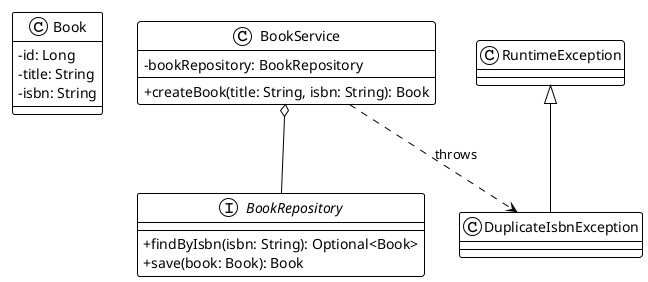

# Chapitre 4 : Tester le Cœur de l'Application : Les Services

### Objectifs pédagogiques

À la fin de cette partie, vous serez en mesure de :

- **Définir** ce qu'est un test unitaire dans le contexte de Spring.
- **Tester** un bean `@Service` en isolant complètement sa logique métier de ses dépendances.
- **Utiliser** `@MockBean` de manière stratégique pour remplacer les repositories et autres services.
- **Valider** non seulement les retours de méthodes, mais aussi les interactions avec les dépendances (vérifier que des
  méthodes ont été appelées).
- **Distinguer** quand un test avec le contexte Spring est utile et quand un test Mockito pur suffit.

### Introduction : Le moteur sur le banc d'essai

Imaginez que vous êtes un ingénieur motoriste. Dans le chapitre précédent, nous avons testé la voiture entière sur la
piste avec `@SpringBootTest`. C'était utile pour voir le comportement global. Mais aujourd'hui, votre mission est
différente. Vous devez vérifier une pièce maîtresse : le moteur lui-même. Vous voulez mesurer sa puissance, sa
consommation, sa fiabilité, sans être distrait par les pneus, le châssis ou l'aérodynamisme.

Que faites-vous ? Vous ne mettez pas la voiture entière sur le banc d'essai. Vous sortez le moteur, vous le placez sur
un banc d'essai spécialisé, vous branchez des sondes, des arrivées de carburant et des échappements contrôlés. Vous
l'isolez pour le tester dans des conditions parfaites.

Tester un service Spring, c'est exactement cela. Le service est le moteur de votre application : il contient la logique
métier. Le banc d'essai, c'est votre classe de test. Les dépendances (repositories, autres services) sont les éléments
externes que vous allez simuler (`@MockBean`) pour avoir un contrôle total sur l'environnement du moteur.

### Qu'est-ce qu'un "Test Unitaire" dans un Contexte Spring ?

La définition puriste d'un test unitaire implique qu'il n'y ait **aucun** framework impliqué. Vous créeriez vos objets
manuellement avec `new`. Cependant, dans l'écosystème Spring, on parle souvent de "test unitaire de service" pour un
test qui, même s'il utilise le lanceur de test de Spring, a pour objectif de **tester une seule unité (le service) en
isolant toutes ses dépendances**.

<tabs>

<tab title="Le Test Unitaire Pur (Mockito seul)">
<p>C'est l'approche la plus rapide et la plus fidèle à la définition de "test unitaire".</p>
<code-block lang="java">
@ExtendWith(MockitoExtension.class)
class MyServicePureUnitTest {
    @Mock
    private MyRepository mockRepo;

    private MyService myService;
    
    @BeforeEach
    void setUp() {
        // Injection manuelle
        myService = new MyService(mockRepo);
    }
    
    @Test
    void testSomething() { /* ... */ }

}
</code-block>
<ul>
<li><b>Avantages :</b> Extrêmement rapide (pas de contexte Spring à démarrer).</li>
<li><b>Inconvénients :</b> Vous devez instancier manuellement la classe. Si le service a 10 dépendances, c'est fastidieux.</li>
</ul>
</tab>

<tab title="Le Test Unitaire façon Spring">
<p>C'est l'approche que nous allons privilégier. Elle utilise le lanceur de Spring mais se concentre sur un seul bean.</p>
<code-block lang="java">
@SpringBootTest(classes = MyService.class)
class MyServiceSpringUnitTest {
    @MockBean
    private MyRepository mockRepo;

    @Autowired
    private MyService myService;
    
    @Test
    void testSomething() { /* ... */ }

}
</code-block>
<ul>
<li><b>Avantages :</b> Spring gère l'instanciation et l'injection pour vous. C'est plus simple si vous avez beaucoup de dépendances.</li>
<li><b>Inconvénients :</b> Légèrement plus lent car un mini-contexte Spring est démarré.</li>
</ul>
</tab>
</tabs>

<tip>
Pour les services complexes, l'approche "façon Spring" est souvent un excellent compromis entre la pureté du test unitaire et le confort du framework.
</tip>

### Tester la Logique d'un Service

Prenons un exemple concret. Un `BookService` qui doit empêcher la création d'un livre si son ISBN existe déjà. C'est une
règle métier cruciale.



**Le code du service :**

```java
// fr.formation.spring.service.BookService.java
@Service
public class BookService {
    private final BookRepository bookRepository;

    public BookService(BookRepository bookRepository) {
        this.bookRepository = bookRepository;
    }

    public Book createBook(String title, String isbn) {
        // Règle métier : vérifier l'unicité de l'ISBN
        if (bookRepository.findByIsbn(isbn).isPresent()) {
            throw new DuplicateIsbnException(
                    "Un livre avec l'ISBN " + isbn + " existe déjà."
            );
        }

        Book newBook = new Book(title, isbn);
        return bookRepository.save(newBook);
    }
}
```

Maintenant, mettons ce "moteur" sur le banc d'essai.

```java
// src/test/java/fr/formation/spring/service/BookServiceTest.java
package fr.formation.spring.service;

import fr.formation.spring.entity.Book;
import fr.formation.spring.repository.BookRepository;
import fr.formation.spring.exception.DuplicateIsbnException;

import org.junit.jupiter.api.DisplayName;
import org.junit.jupiter.api.Test;
import org.springframework.beans.factory.annotation.Autowired;
import org.springframework.boot.test.context.SpringBootTest;
import org.springframework.boot.test.mock.mockito.MockBean;

import java.util.Optional;

import static org.assertj.core.api.Assertions.assertThat;
import static org.assertj.core.api.Assertions.assertThatThrownBy;
import static org.mockito.Mockito.when;
import static org.mockito.Mockito.verify;
import static org.mockito.Mockito.any;
import static org.mockito.Mockito.never;

// On ne charge que le service pour aller plus vite.
@SpringBootTest(classes = BookService.class)
class BookServiceTest {

    @Autowired
    private BookService bookService;

    @MockBean
    private BookRepository mockBookRepository;

    @Test
    @DisplayName("Devrait créer un livre avec succès si l'ISBN est unique")
    void createBook_shouldSucceed_whenIsbnIsUnique() {
        // Arrange
        String title = "Spring en Action";
        String isbn = "978-2-123456-78-9";
        Book bookToSave = new Book(title, isbn);

        // Simuler le comportement du repository
        when(mockBookRepository.findByIsbn(isbn)).thenReturn(Optional.empty());
        when(mockBookRepository.save(any(Book.class))).thenReturn(bookToSave);

        // Act
        Book createdBook = bookService.createBook(title, isbn);

        // Assert
        assertThat(createdBook).isNotNull();
        assertThat(createdBook.getTitle()).isEqualTo(title);

        // Vérifier l'interaction : la méthode save a-t-elle été appelée ?
        verify(mockBookRepository).save(any(Book.class));
    }

    @Test
    @DisplayName("Devrait lancer une exception si l'ISBN existe déjà")
    void createBook_shouldThrowException_whenIsbnExists() {
        // Arrange
        String isbn = "978-2-123456-78-9";
        Book existingBook = new Book("Livre Existant", isbn);

        // Simuler le comportement du repository
        when(mockBookRepository.findByIsbn(isbn)).thenReturn(Optional.of(existingBook));

        // Act & Assert
        assertThatThrownBy(() -> {
            bookService.createBook("Nouveau Livre", isbn);
        })
                .isInstanceOf(DuplicateIsbnException.class)
                .hasMessageContaining("existe déjà");

        // Vérifier l'interaction : la méthode save ne doit JAMAIS avoir été appelée
        verify(mockBookRepository, never()).save(any(Book.class));
    }
}
```

### Tester des Composants Utilitaires Simples

Que faire pour un simple bean `@Component` qui n'a pas ou peu de dépendances complexes ?

```java
// fr.formation.spring.util.SlugGenerator.java
@Component
public class SlugGenerator {
    public String generate(String input) {
        if (input == null) return "";
        return input.toLowerCase()
                .replaceAll("\\s+", "-") // remplace les espaces par des tirets
                .replaceAll("[^a-z0-9-]", ""); // enlève les caractères spéciaux
    }
}
```

Ici, utiliser `@SpringBootTest` serait excessif. C'est comme utiliser un pont roulant pour soulever un tournevis. Un
test unitaire pur avec JUnit est parfait, plus simple et plus rapide.

```java
// Test pur, sans Spring
class SlugGeneratorTest {
    private final SlugGenerator generator = new SlugGenerator();

    @Test
    void shouldGenerateCorrectSlug() {
        String input = "Les Tests en Java!";
        String expected = "les-tests-en-java";
        assertThat(generator.generate(input)).isEqualTo(expected);
    }
}
```

### Exercice 7 : Tester une logique de suppression conditionnelle

Vous travaillez sur un `AuthorService`. Une règle métier importante stipule qu'on ne peut pas supprimer un auteur s'il a
encore des livres publiés dans le système. Votre service doit vérifier cela avant de procéder à la suppression.

**Code de départ :**

```java
// Entité Author et Book (JPA)
// ... supposons qu'un Author a une List<Book> books;

// fr.formation.spring.repository.AuthorRepository.java
public interface AuthorRepository extends JpaRepository<Author, Long> {
}

// fr.formation.spring.repository.BookRepository.java
public interface BookRepository extends JpaRepository<Book, Long> {
    // Compte le nombre de livres pour un auteur donné
    long countByAuthorId(Long authorId);
}

// fr.formation.spring.exception.AuthorDeletionException.java
public class AuthorDeletionException extends RuntimeException {
    public AuthorDeletionException(String message) {
        super(message);
    }
}

// fr.formation.spring.service.AuthorService.java
@Service
public class AuthorService {
    private final AuthorRepository authorRepository;
    private final BookRepository bookRepository;

    public AuthorService(AuthorRepository authorRepository, BookRepository bookRepository) {
        this.authorRepository = authorRepository;
        this.bookRepository = bookRepository;
    }

    public void deleteAuthor(Long authorId) {
        long bookCount = bookRepository.countByAuthorId(authorId);
        if (bookCount > 0) {
            throw new AuthorDeletionException(
                    "Impossible de supprimer l'auteur, il a encore " +
                            bookCount + " livre(s) publié(s)."
            );
        }
        authorRepository.deleteById(authorId);
    }
}
```

**Votre mission :**
Écrivez une classe de test `AuthorServiceTest` avec deux tests pour la méthode `deleteAuthor`:

1. Un test qui vérifie que l'exception `AuthorDeletionException` est bien lancée si l'auteur a des livres.
2. Un test qui vérifie que la méthode `authorRepository.deleteById` est bien appelée si l'auteur n'a aucun livre.

Utilisez `@SpringBootTest(classes = ...)` et `@MockBean`.

### Correction exercice 7 {collapsible="true"}

```java
// Fichier : src/test/java/fr/formation/spring/service/AuthorServiceTest.java
package fr.formation.spring.service;

import fr.formation.spring.exception.AuthorDeletionException;
import fr.formation.spring.repository.AuthorRepository;
import fr.formation.spring.repository.BookRepository;
import org.junit.jupiter.api.DisplayName;
import org.junit.jupiter.api.Test;
import org.springframework.beans.factory.annotation.Autowired;
import org.springframework.boot.test.context.SpringBootTest;
import org.springframework.boot.test.mock.mockito.MockBean;

import static org.assertj.core.api.Assertions.assertThatThrownBy;
import static org.mockito.Mockito.*;

@SpringBootTest(classes = AuthorService.class)
class AuthorServiceTest {

    @Autowired
    private AuthorService authorService;

    @MockBean
    private AuthorRepository mockAuthorRepository;

    @MockBean
    private BookRepository mockBookRepository;

    @Test
    @DisplayName("Devrait lancer une exception si l'auteur a encore des livres")
    void deleteAuthor_shouldThrowException_whenAuthorHasBooks() {
        // Arrange
        Long authorIdWithBooks = 1L;
        // On dit à notre mock de repository de livres de retourner "2"
        // quand on compte les livres pour cet auteur.
        when(mockBookRepository.countByAuthorId(authorIdWithBooks)).thenReturn(2L);

        // Act & Assert
        assertThatThrownBy(() -> authorService.deleteAuthor(authorIdWithBooks))
                .isInstanceOf(AuthorDeletionException.class)
                .hasMessageContaining("il a encore 2 livre(s) publié(s)");

        // On vérifie que la suppression n'a jamais été tentée
        verify(mockAuthorRepository, never()).deleteById(anyLong());
    }

    @Test
    @DisplayName("Devrait supprimer l'auteur s'il n'a pas de livres")
    void deleteAuthor_shouldSucceed_whenAuthorHasNoBooks() {
        // Arrange
        Long authorIdWithoutBooks = 2L;
        // On dit à notre mock de retourner 0.
        when(mockBookRepository.countByAuthorId(authorIdWithoutBooks)).thenReturn(0L);
        // On ne configure pas l'appel à deleteById car la méthode est void.
        // Mockito ne fera rien par défaut, ce qui est parfait.

        // Act
        authorService.deleteAuthor(authorIdWithoutBooks);

        // Assert (en vérifiant l'interaction)
        // On vérifie que la méthode deleteById a bien été appelée
        // sur le mock du repository d'auteurs, une seule fois, avec le bon ID.
        verify(mockAuthorRepository, times(1)).deleteById(authorIdWithoutBooks);
    }
}
```

### Auto-évaluation

1. (Question ouverte) Pourquoi est-il souvent préférable d'utiliser `@SpringBootTest(classes = MonService.class)` plutôt
   qu'un `@SpringBootTest` complet pour tester un service de manière unitaire ?
2. (QCM) Dans un test de service, à quoi sert principalement `@MockBean` ?
    * a) À créer des données de test pour la base de données.
    * b) À remplacer les dépendances du service (comme les repositories) par des simulations contrôlées par Mockito.
    * c) À injecter le service à tester.
    * d) À vérifier que le service est bien un bean Spring.
3. (Question ouverte) Vous testez une méthode `void`. Comment pouvez-vous vérifier qu'elle a fonctionné correctement ?
   Donnez au moins une stratégie.
4. (QCM) Quelle affirmation est vraie concernant un test unitaire "pur" (avec `@ExtendWith(MockitoExtension.class)`)
   comparé à un test avec `@SpringBootTest` ?
    * a) Le test pur est plus lent.
    * b) Le test pur nécessite d'injecter les dépendances avec `@Autowired`.
    * c) Le test pur n'utilise pas du tout le framework Spring pour son exécution, il est donc plus rapide.
    * d) Le test pur ne peut pas utiliser Mockito.
5. (QCM) Dans la correction de l'exercice, `verify(mockAuthorRepository, never()).deleteById(anyLong());` permet de
   s'assurer que :
    * a) La méthode `deleteById` sera appelée plus tard.
    * b) La méthode `deleteById` a été appelée avec une valeur nulle.
    * c) La méthode `deleteById` n'a pas été appelée du tout pendant l'exécution du test.
    * d) La méthode `deleteById` a lancé une exception.

*(Les corrections de l'auto-évaluation seront fournies à la toute fin du support de cours.)*

### Conclusion de la partie

Félicitations ! Vous venez de maîtriser la technique la plus importante pour garantir la qualité de votre logique
métier. Vous savez désormais comment placer un "moteur" (`@Service`) sur un banc d'essai, en isolant ses dépendances
avec `@MockBean` pour tester chaque règle métier de manière chirurgicale. Vous avez appris à valider non seulement les
sorties, mais aussi les comportements et les interactions, ce qui est fondamental.

Vous avez également compris la nuance entre un test unitaire pur et un test unitaire "façon Spring", ce qui vous permet
de choisir le bon outil pour la bonne tâche.

Maintenant que notre logique métier est robuste, il est temps de remonter d'un cran. Dans le prochain chapitre, nous
allons nous intéresser à la façade de notre application : la couche Web. Nous apprendrons à tester nos contrôleurs REST
pour nous assurer qu'ils exposent correctement nos services au monde extérieur.