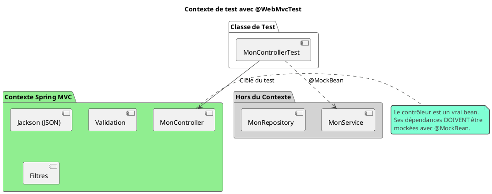

# Chapitre 5 : Tester la Façade : Les Contrôleurs REST (L'essentiel)

### Objectifs pédagogiques

À la fin de cette partie, vous serez en mesure de :

- **Expliquer** le concept de test par "tranche" (slice testing) et l'utilité de `@WebMvcTest`.
- **Utiliser** `MockMvc` pour simuler des requêtes HTTP (GET, POST, etc.) vers vos contrôleurs.
- **Rédiger** des assertions sur la réponse HTTP : statut, headers et contenu du corps (body).
- **Valider** que la sérialisation JSON des objets de réponse fonctionne comme prévu.
- **Tester** les mécanismes de validation des données d'entrée (`@Valid`).

### Introduction : Le gardien à l'entrée du club

Imaginez que votre application est un club privé très select. Le chapitre précédent nous a permis de nous assurer que le
barman (`Service`) sait faire des cocktails parfaits et que le DJ (`Service`) passe la bonne musique. Mais tout cela ne
sert à rien si le gardien à l'entrée (`Controller`) ne fait pas son travail.

Le gardien doit :

- Comprendre les demandes des clients (`GET /drinks`, `POST /members`).
- Vérifier les invitations (`@Valid`, sécurité).
- Transmettre les demandes correctement au personnel à l'intérieur (`Service`).
- Donner une réponse claire au client ("Voici votre boisson", "Désolé, vous ne pouvez pas entrer").

Tester un contrôleur REST, ce n'est pas tester la logique métier à nouveau. C'est tester le **gardien**. On ne va pas
vérifier si le cocktail est bon, on va s'assurer que si un client commande un "Mojito", le gardien transmet bien la
commande "Mojito" au barman et que la réponse est correcte. Pour ce faire, on va simuler un client qui arrive à la porte
et on va observer la réaction du gardien.

### `@WebMvcTest` : Le Test en Tranche pour la Couche Web

Charger toute l'application avec `@SpringBootTest` pour tester un simple contrôleur, c'est comme mobiliser tout le
personnel du club juste pour tester le gardien. C'est lent et inutile.

Spring Boot propose une solution bien plus élégante : le **test en tranche** (slice test) avec `@WebMvcTest`.

Quand vous utilisez `@WebMvcTest(MonController.class)`, Spring Boot fait quelque chose de très intelligent :

- Il **ne charge PAS** toute l'application.
- Il configure uniquement l'infrastructure nécessaire pour tester la couche Spring MVC : les contrôleurs, les filtres,
  les `JsonSerializers`, etc.
- Les beans `@Service`, `@Repository`, `@Component` **ne sont PAS chargés**. C'est voulu !
- Par conséquent, vous **DEVEZ** fournir des mocks pour les dépendances de votre contrôleur (généralement les services)
  en utilisant `@MockBean`.



### `MockMvc` : Votre Client HTTP Simulé

Pour parler à notre "gardien", nous avons besoin d'un client. `MockMvc` est ce client. Il est fourni par Spring Test et
vous permet de simuler des requêtes HTTP de manière très simple et fluide, sans passer par une vraie couche réseau. Il
est injecté automatiquement dans votre test quand vous utilisez `@WebMvcTest`.

Voici la structure d'un appel `MockMvc` :

```java
mockMvc.perform( /* 1. Construire la requête */)
       .andExpect( /* 2. Valider le statut, les headers */)
       .andExpect( /* 3. Valider le contenu du corps */)
       .andDo( /* 4. (Optionnel) Imprimer les détails */);
```

### Test d'un Endpoint GET

Prenons un contrôleur simple qui retourne une liste de livres.

```java
// fr.formation.spring.api.BookController.java
@RestController
@RequestMapping("/api/books")
public class BookController {
    private final BookService bookService;

    public BookController(BookService bookService) {
        this.bookService = bookService;
    }

    @GetMapping
    public List<Book> getAllBooks() {
        return bookService.findAll();
    }

    @GetMapping("/{id}")
    public ResponseEntity<Book> getBookById(@PathVariable Long id) {
        return bookService.findById(id)
                .map(ResponseEntity::ok) // Si trouvé -> 200 OK
                .orElse(ResponseEntity.notFound().build()); // Sinon -> 404 Not Found
    }
}
```

**Le test correspondant :**

```java
// src/test/java/fr/formation/spring/api/BookControllerTest.java
package fr.formation.spring.api;

import fr.formation.spring.entity.Book;
import fr.formation.spring.service.BookService;

import org.junit.jupiter.api.Test;
import org.springframework.beans.factory.annotation.Autowired;
import org.springframework.boot.test.autoconfigure.web.servlet.WebMvcTest;
import org.springframework.boot.test.mock.mockito.MockBean;
import org.springframework.test.web.servlet.MockMvc;

import java.util.List;
import java.util.Optional;

import static org.mockito.Mockito.when;
import static org.springframework.test.web.servlet.request.MockMvcRequestBuilders.get;
import static org.springframework.test.web.servlet.result.MockMvcResultMatchers.jsonPath;
import static org.springframework.test.web.servlet.result.MockMvcResultMatchers.status;
import static org.hamcrest.Matchers.is;
import static org.hamcrest.Matchers.hasSize;

@WebMvcTest(BookController.class) // On cible uniquement ce contrôleur
class BookControllerTest {

    @Autowired
    private MockMvc mockMvc; // Le client HTTP simulé

    @MockBean
    private BookService mockBookService; // La dépendance est mockée

    @Test
    void getAllBooks_shouldReturnBookList() throws Exception {
        // Arrange
        Book book1 = new Book(1L, "Titre 1", "Auteur 1");
        Book book2 = new Book(2L, "Titre 2", "Auteur 2");
        when(mockBookService.findAll()).thenReturn(List.of(book1, book2));

        // Act & Assert
        mockMvc.perform(get("/api/books"))
                .andExpect(status().isOk()) // Statut HTTP 200
                .andExpect(jsonPath("$", hasSize(2))) // Le tableau JSON a 2 éléments
                .andExpect(jsonPath("$[0].title", is("Titre 1"))); // Le titre du 1er
    }

    @Test
    void getBookById_shouldReturn404_whenBookNotFound() throws Exception {
        // Arrange
        when(mockBookService.findById(99L)).thenReturn(Optional.empty());

        // Act & Assert
        mockMvc.perform(get("/api/books/99"))
                .andExpect(status().isNotFound()); // Statut HTTP 404
    }
}
```

<tip>
**JsonPath** est votre meilleur ami pour inspecter les réponses JSON. La syntaxe `$` représente la racine du document. `$[0]` est le premier élément d'un tableau. `$.title` est la propriété `title` d'un objet.
</tip>

### Test d'un Endpoint POST et de la Validation

Tester un POST est similaire, mais on doit fournir un corps de requête. C'est l'occasion de tester la validation.

```java
// DTO pour la création, avec des contraintes de validation
public class CreateBookDto {
    @NotBlank
    private String title;
    @NotBlank
    @Size(min = 10, max = 13)
    private String isbn;
    // ...
}

// Dans le BookController
@PostMapping
public ResponseEntity<Book> createBook(@Valid @RequestBody CreateBookDto bookDto) {
    Book createdBook = bookService.create(bookDto);
    return new ResponseEntity<>(createdBook, HttpStatus.CREATED); // 201
}
```

**Le test qui vérifie la validation :**

```java
import com.fasterxml.jackson.databind.ObjectMapper; // Pour convertir l'objet en JSON

@WebMvcTest(BookController.class)
class BookControllerTest {

    @Autowired
    private MockMvc mockMvc;
    @MockBean
    private BookService mockBookService;
    @Autowired
    private ObjectMapper objectMapper; // Spring le fournit

    @Test
    void createBook_shouldReturn400_whenTitleIsBlank() throws Exception {
        // Arrange
        CreateBookDto invalidDto = new CreateBookDto("", "1234567890");

        // Act & Assert
        mockMvc.perform(post("/api/books")
                        .contentType(MediaType.APPLICATION_JSON) // Très important !
                        .content(objectMapper.writeValueAsString(invalidDto))) // Convertir en JSON
                .andExpect(status().isBadRequest()); // Statut HTTP 400
    }
}
```

### Exercice 8 : Tester un endpoint de mise à jour (PUT)

Dans votre `BookController`, vous avez un endpoint pour mettre à jour un livre existant.

```java
// DTO pour la mise à jour
public class UpdateBookDto {
    @NotBlank
    private String title;
    // ...
}

// Dans le BookController
@PutMapping("/{id}")
public ResponseEntity<Book> updateBook(@PathVariable Long id,
                                       @Valid @RequestBody UpdateBookDto bookDto) {
    try {
        Book updatedBook = bookService.update(id, bookDto);
        return ResponseEntity.ok(updatedBook);
    } catch (BookNotFoundException ex) {
        return ResponseEntity.notFound().build();
    }
}
```

**Votre mission :**
Écrivez un test pour le cas où la mise à jour réussit.

1. Utilisez `@WebMvcTest` et moquez le `BookService`.
2. Dans votre test, configurez le mock `bookService` : quand la méthode `update` est appelée avec un ID et un DTO
   spécifiques, elle doit retourner un objet `Book` mis à jour.
3. Utilisez `MockMvc` pour simuler une requête `PUT` vers `/api/books/{id}`. N'oubliez pas le `contentType` et le corps
   de la requête en JSON.
4. Vérifiez que le statut de la réponse est `200 OK`.
5. Vérifiez avec `jsonPath` que le titre du livre dans la réponse JSON correspond bien au titre mis à jour.

### Correction exercice 8 {collapsible="true"}

```java
// src/test/java/fr/formation/spring/api/BookControllerTest.java
// ... (ajouts dans la classe existante)

import static org.springframework.test.web.servlet.request.MockMvcRequestBuilders.put;

// ...

@Test
void updateBook_shouldReturnUpdatedBook_whenSuccess() throws Exception {
    // Arrange
    Long bookId = 1L;
    UpdateBookDto updateDto = new UpdateBookDto("Nouveau Titre Super");
    Book updatedBook = new Book(bookId, "Nouveau Titre Super", "Auteur Maintenu");

    // Configurer le mock du service
    // QUAND update est appelé avec l'ID 1 et n'importe quel DTO...
    when(mockBookService.update(eq(bookId), any(UpdateBookDto.class)))
            .thenReturn(updatedBook);

    // Act & Assert
    mockMvc.perform(put("/api/books/{id}", bookId) // Utilise une variable pour l'URL
                    .contentType(MediaType.APPLICATION_JSON)
                    .content(objectMapper.writeValueAsString(updateDto)))
            .andExpect(status().isOk())
            .andExpect(jsonPath("$.id", is(bookId.intValue())))
            .andExpect(jsonPath("$.title", is("Nouveau Titre Super")));
}

```

### Auto-évaluation

1. (Question ouverte) Quelle est la principale différence, en termes de contexte Spring chargé, entre `@SpringBootTest`
   et `@WebMvcTest` ?
2. (QCM) Dans un test annoté avec `@WebMvcTest(MyController.class)`, les beans `@Service` sont :
    * a) Tous chargés dans le contexte.
    * b) Non chargés, et doivent être mockés avec `@MockBean` si le contrôleur en dépend.
    * c) Mockés automatiquement par Spring.
    * d) Chargés uniquement si le contrôleur les utilise.
3. (Question ouverte) À quoi sert l'objet `MockMvc` et comment l'obtient-on dans un test ?
4. (QCM) Pour vérifier le contenu d'une réponse JSON, quelle est la méthode la plus appropriée ?
    * a) `andExpect(content().string("..."))`
    * b) `andExpect(jsonPath("$.cle", is("valeur")))`
    * c) `andDo(print())`
    * d) `andExpect(status().isOk())`
5. (QCM) Vous voulez simuler un `POST` avec un corps de requête JSON. Que devez-vous faire impérativement ?
    * a) Ne rien faire, Spring devine le contenu.
    * b) Ajouter un header `Accept: application/json`.
    * c) Utiliser la méthode `content()` pour fournir le JSON et définir le `contentType` à
      `MediaType.APPLICATION_JSON`.
    * d) Utiliser la méthode `param()` pour chaque champ JSON.

*(Les corrections de l'auto-évaluation seront fournies à la toute fin du support de cours.)*

### Conclusion de la partie

Vous êtes maintenant le gardien de votre propre gardien ! Vous savez comment utiliser `@WebMvcTest` pour mettre en place
un environnement de test léger et ciblé pour votre couche web. Vous maîtrisez `MockMvc`, votre client HTTP de confiance,
pour simuler toutes sortes de requêtes et valider avec précision les réponses, que ce soit le statut, les headers ou le
corps JSON.

Tester vos contrôleurs de cette manière vous donne une confiance immense : vous savez que votre application expose
correctement sa logique métier et qu'elle gère bien les entrées des utilisateurs.

Notre prochain arrêt nous emmène dans les fondations de notre application : la couche d'accès aux données. Nous allons
apprendre à tester que nos requêtes JPA et nos repositories fonctionnent exactement comme prévu, en interagissant avec
une vraie base de données de test.