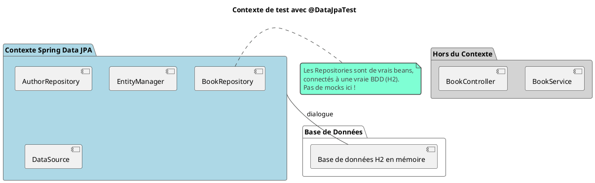

# Chapitre 6 : Tester les Fondations : La Couche d'Accès aux Données

### Objectifs pédagogiques

À la fin de cette partie, vous serez en mesure de :

- **Utiliser** le test en tranche `@DataJpaTest` pour tester vos repositories JPA.
- **Expliquer** le rôle de la base de données en mémoire (H2) dans les tests de persistance.
- **Manipuler** des entités dans un contexte de test avec `TestEntityManager`.
- **Comprendre** le comportement transactionnel par défaut des tests `@DataJpaTest` et son impact.
- **Écrire** des tests pour valider les requêtes personnalisées de vos repositories.

### Introduction : L'archiviste méticuleux

Imaginez que votre application est une immense bibliothèque. Nous avons testé le bibliothécaire en chef (`Service`) qui
connaît toutes les règles de prêt et le réceptionniste (`Controller`) qui accueille les visiteurs. Mais qui s'assure que
lorsque l'on demande le livre "Codex Seraphinianus", on ne reçoit pas "Martine à la ferme" ? Qui garantit que les livres
sont rangés au bon endroit et que l'on peut les retrouver ?

C'est le rôle de l'archiviste : la couche de persistance (`Repository`). Son travail est crucial. Il doit comprendre
parfaitement le système de classement (JPA, SQL) et être capable de stocker et de récupérer des informations sans
erreur.

Tester la couche d'accès aux données, c'est vérifier le travail de cet archiviste. On ne teste pas la logique métier (
ça, c'est le rôle du service), mais on teste si nos requêtes et nos méthodes de repository dialoguent correctement avec
la base de données. Pour cela, on va lui donner quelques livres, lui demander de les ranger, puis de nous les retrouver.

### `@DataJpaTest` : Le Test en Tranche pour la Persistance

Tout comme `@WebMvcTest` créait un "slice" pour la couche web, `@DataJpaTest` crée une tranche optimisée pour tester la
couche JPA.

Quand vous utilisez `@DataJpaTest`, Spring Boot configure un environnement minimaliste mais puissant :

- Il configure une **base de données en mémoire (H2)** par défaut. C'est ultra-rapide et ne nécessite aucune
  installation.
- Il scanne vos entités (`@Entity`) et vos repositories Spring Data (`@Repository`).
- Il **ne charge PAS** les autres beans comme les `@Service`, `@Controller` ou `@Component`.
- Chaque test est exécuté dans une **transaction qui est automatiquement annulée (rollback)** à la fin. Cela garantit
  que chaque test est indépendant et ne pollue pas la base de données pour les tests suivants.



### `TestEntityManager` : Votre Assistant pour la Gestion des Entités

Dans un test `@DataJpaTest`, comment insérer des données pour pouvoir ensuite les tester ? C'est là qu'intervient le
`TestEntityManager`. C'est un wrapper autour de l'`EntityManager` de JPA, mais avec des méthodes simplifiées,
spécialement conçues pour les tests.

Il vous permet de :

- `persist(entity)`: Sauvegarder une entité en base.
- `flush()`: Forcer la synchronisation entre le contexte de persistance et la base de données (exécuter les requêtes SQL
  en attente).
- `find(class, id)`: Retrouver une entité par son ID.
- `persistAndFlush(entity)`: Une combinaison pratique des deux premières méthodes.

```java
// src/test/java/fr/formation/spring/repository/BookRepositoryTest.java
package fr.formation.spring.repository;

import fr.formation.spring.entity.Book;
import org.junit.jupiter.api.Test;
import org.springframework.beans.factory.annotation.Autowired;
import org.springframework.boot.test.autoconfigure.orm.jpa.DataJpaTest;
import org.springframework.boot.test.autoconfigure.orm.jpa.TestEntityManager;

import java.util.Optional;

import static org.assertj.core.api.Assertions.assertThat;

@DataJpaTest
class BookRepositoryTest {

    @Autowired
    private TestEntityManager entityManager; // L'assistant pour les entités

    @Autowired
    private BookRepository bookRepository; // Le repository à tester

    @Test
    void findById_shouldReturnBook_whenBookExists() {
        // Arrange : On crée et on persiste un livre
        Book bookToSave = new Book("Le Mythe de Cthulhu", "H.P. Lovecraft");
        Book savedBook = entityManager.persistAndFlush(bookToSave);

        // Act : On utilise le repository pour le retrouver
        Optional<Book> foundBookOpt = bookRepository.findById(savedBook.getId());

        // Assert : On vérifie le résultat
        assertThat(foundBookOpt).isPresent();
        assertThat(foundBookOpt.get().getTitle()).isEqualTo(bookToSave.getTitle());
    }
}
```

<warning>
**Pourquoi `persistAndFlush` ?** En JPA, l'appel à `persist` ne déclenche pas forcément un `INSERT` immédiat. La requête peut être mise en attente. `flush` force l'envoi de la requête à la base de données, ce qui garantit que les données sont bien présentes quand votre repository va essayer de les lire.
</warning>

### Tester une Requête Personnalisée

Le véritable intérêt de tester les repositories apparaît lorsque vous écrivez vos propres requêtes. Spring Data JPA fait
beaucoup de magie pour vous, mais c'est à vous de garantir que vos requêtes personnalisées (en JPQL ou via les noms de
méthodes) sont correctes.

Imaginons que nous ajoutions une méthode pour trouver des livres par auteur dans notre `BookRepository`.

```java
// fr.formation.spring.repository.BookRepository.java
public interface BookRepository extends JpaRepository<Book, Long> {
    // Requête générée par le nom de la méthode
    List<Book> findByAuthor(String author);

    // Requête personnalisée avec @Query
    @Query("SELECT b FROM Book b WHERE b.title LIKE %:keyword%")
    List<Book> searchByTitleKeyword(@Param("keyword") String keyword);
}
```

**Le test pour `findByAuthor` :**

```java
// Dans BookRepositoryTest.java

@Test
void findByAuthor_shouldReturnBooksForGivenAuthor() {
    // Arrange
    entityManager.persist(new Book("L'Appel de Cthulhu", "H.P. Lovecraft"));
    entityManager.persist(new Book("Les Montagnes Hallucinées", "H.P. Lovecraft"));
    entityManager.persist(new Book("Le Roi en Jaune", "R.W. Chambers"));
    entityManager.flush();

    // Act
    List<Book> lovecraftBooks = bookRepository.findByAuthor("H.P. Lovecraft");

    // Assert
    assertThat(lovecraftBooks).hasSize(2)
            .allMatch(b -> b.getAuthor().equals("H.P. Lovecraft"));
}
```

### Le Rollback Transactionnel Automatique

Par défaut, `@DataJpaTest` est annoté avec `@Transactional`. Dans un contexte de test, cela a un comportement spécial :
**toute modification faite à la base de données est annulée (rollback) à la fin de la méthode de test.**

C'est une fonctionnalité géniale, car elle garantit que chaque test s'exécute sur une base de données "propre", sans
avoir besoin d'écrire du code de nettoyage.

```java

@Test
void test1() {
    // Arrange: on insère un livre
    entityManager.persistAndFlush(new Book("Titre 1", "Auteur 1"));
    // Le livre existe ici
}
// FIN de test1: la transaction est annulée, le livre est supprimé.

@Test
void test2() {
    // Le livre inséré dans test1 N'EXISTE PAS ici.
    // La base est revenue à son état initial.
    long count = bookRepository.count();
    assertThat(count).isEqualTo(0); // (en supposant la base vide au départ)
}
```

Si jamais vous avez besoin de désactiver ce comportement (cas très rare), vous pouvez annoter votre test avec
`@Rollback(false)`.

### Exercice 9 : Tester une requête de recherche complexe

Vous voulez ajouter une fonctionnalité de recherche à votre `BookRepository`. La méthode doit trouver tous les livres
qui contiennent un mot-clé dans leur titre ET qui sont marqués comme "best-seller".

**Votre mission :**

1. Ajoutez la méthode suivante à votre interface `BookRepository` (vous devrez ajouter le champ `isBestSeller` à votre
   entité `Book` si ce n'est pas déjà fait) :
   ```java
   @Query("SELECT b FROM Book b WHERE b.isBestSeller = true AND " +
          "LOWER(b.title) LIKE LOWER(CONCAT('%', :keyword, '%'))")
   List<Book> findBestSellersByTitleKeyword(@Param("keyword") String keyword);
   ```
2. Dans votre classe `BookRepositoryTest`, écrivez un test pour cette nouvelle méthode.
3. Utilisez `TestEntityManager` pour persister plusieurs livres :
    - Un best-seller dont le titre correspond au mot-clé.
    - Un livre normal (non best-seller) dont le titre correspond.
    - Un best-seller dont le titre ne correspond pas.
4. Appelez votre nouvelle méthode de repository avec un mot-clé pertinent.
5. Utilisez AssertJ pour vérifier que la liste retournée contient **exactement un livre**, et que c'est bien le bon.

### Correction exercice 9 {collapsible="true"}

```java
// Entité Book modifiée
// @Entity
// public class Book {
//     // ... id, title, author
//     private boolean isBestSeller;
// }

// src/test/java/fr/formation/spring/repository/BookRepositoryTest.java
@DataJpaTest
class BookRepositoryTest {

    // ... @Autowired TestEntityManager, BookRepository

    @Test
    @DisplayName("Devrait trouver les best-sellers contenant un mot-clé dans le titre")
    void findBestSellersByTitleKeyword_shouldReturnMatchingBestSellers() {
        // Arrange
        entityManager.persist(new Book("Java pour les Nuls", "Barry Burd", true)); // Correspond
        entityManager.persist(new Book("Spring en Action", "Craig Walls", true)); // Ne correspond pas
        entityManager.persist(new Book("Le Guide Complet Java", "H. Schildt", false)); // Correspond mais pas best-seller
        entityManager.persist(new Book("Un autre livre", "Quelqu'un", false)); // Ne correspond pas
        entityManager.flush();

        // Act
        List<Book> results = bookRepository.findBestSellersByTitleKeyword("java");

        // Assert
        assertThat(results).isNotNull();
        assertThat(results).hasSize(1);

        Book foundBook = results.get(0);
        assertThat(foundBook.getTitle()).isEqualTo("Java pour les Nuls");
        assertThat(foundBook.isBestSeller()).isTrue();
    }
}
```

### Auto-évaluation

1. (Question ouverte) Quel est le rôle principal de `@DataJpaTest` et quelles sont les deux configurations clés qu'il
   met en place par défaut ?
2. (QCM) Dans un test `@DataJpaTest`, pourquoi le rollback automatique des transactions est-il utile ?
    * a) Pour améliorer les performances des tests.
    * b) Pour s'assurer que les données de test sont bien sauvegardées en base.
    * c) Pour garantir l'isolation des tests en nettoyant la base de données après chaque test.
    * d) Pour éviter les erreurs de type `LazyInitializationException`.
3. (Question ouverte) Quelle est la différence entre `entityManager.persist()` et `entityManager.persistAndFlush()` ?
   Dans quel cas utiliser ce dernier ?
4. (QCM) Lorsque vous utilisez `@DataJpaTest`, quels beans de votre application sont chargés dans le contexte de test ?
    * a) Tous les beans (`@Controller`, `@Service`, `@Repository`).
    * b) Uniquement les `@Controller`.
    * c) Uniquement les `@Repository` JPA, les `@Entity` et l'infrastructure de persistance.
    * d) Uniquement les `@Service`.
5. (QCM) `TestEntityManager` est...
    * a) Un mock de l'`EntityManager`.
    * b) Une alternative à l'utilisation d'un `Repository`.
    * c) Une classe utilitaire fournie par Spring Test pour simplifier la manipulation des entités JPA dans les tests.
    * d) Un outil pour écrire des requêtes SQL natives.

*(Les corrections de l'auto-évaluation seront fournies à la toute fin du support de cours.)*

### Conclusion de la partie

Vous avez solidifié les fondations ! Vous savez maintenant comment tester la couche la plus basse, mais la plus
critique de votre application. Avec `@DataJpaTest`, vous pouvez créer un environnement de test de persistance isolé et
rapide. Vous maîtrisez le `TestEntityManager` pour préparer vos données et, plus important encore, vous pouvez écrire
des tests ciblés pour valider que vos requêtes personnalisées se comportent exactement comme vous le souhaitez.

Vous avez maintenant exploré les tests par tranches pour les services, la couche web et la couche de données. Dans le
prochain chapitre, nous allons remonter à la surface et assembler toutes les pièces. Nous verrons quand et comment
utiliser `@SpringBootTest` pour réaliser des tests d'intégration complets, simulant un flux de bout en bout au sein de
votre microservice.