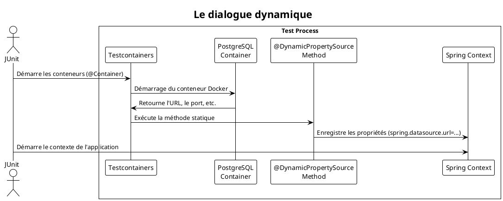

# Chapitre 8 : Le Test en Conditions Réelles : Gérer les Dépendances Externes avec Testcontainers

### Objectifs pédagogiques

À la fin de cette partie, vous serez en mesure de :

- **Expliquer** les limites des bases de données en mémoire comme H2 et pourquoi il est crucial de tester avec une
  technologie proche de la production.
- **Intégrer** Testcontainers dans un projet Spring Boot pour lancer des conteneurs Docker durant les tests.
- **Configurer** Spring Boot pour qu'il se connecte dynamiquement à une base de données (ex: PostgreSQL) lancée par
  Testcontainers.
- **Adapter** un test `@DataJpaTest` existant pour qu'il s'exécute contre un conteneur Docker plutôt que H2.
- **Comprendre** le cycle de vie d'un conteneur de test.

### Introduction : Du simulateur de vol au véritable essai en vol

Jusqu'à présent, pour nos tests de persistance, nous avons utilisé une base de données H2 en mémoire. H2 est un
excellent **simulateur de vol**. Il est rapide, facile à mettre en place, et il nous permet de tester 90% de nos
manœuvres (nos requêtes JPA simples). Mais ce n'est qu'un simulateur. Il ne reproduit pas parfaitement les turbulences,
les conditions météo, ou les petites bizarreries d'un vrai Boeing 737 (votre base de données PostgreSQL ou MySQL de
production).

Une requête qui fonctionne parfaitement sur le simulateur H2 pourrait échouer de manière spectaculaire sur un vrai
moteur de base de données, à cause d'une fonction SQL spécifique, d'un type de données différent, ou d'une contrainte de
casse.

**Testcontainers est la solution pour passer du simulateur à l'essai en vol réel.** C'est une bibliothèque Java qui vous
permet de lancer, de configurer et de détruire n'importe quel service disponible sous forme de conteneur Docker (une
base de données, un broker de messages Kafka, un cache Redis, etc.) directement depuis votre code de test. Vous ne
simulez plus, vous testez contre la **vraie technologie**.

### Qu'est-ce que Testcontainers ?

Testcontainers est un véritable "game-changer" pour les tests d'intégration. Il vous apporte :

- **Haute Fidélité :** Vos tests s'exécutent contre le même moteur de base de données que vous utilisez en production.
  La confiance dans vos tests est décuplée.
- **Environnements Jetables :** Chaque exécution de test dispose d'un conteneur frais et propre. Pas de risque de
  pollution entre les tests ou les exécutions.
- **Polyvalence :** Vous pouvez tester l'intégration avec PostgreSQL, MySQL, Kafka, RabbitMQ, Redis, Elasticsearch...
  tout ce qui peut être "dockerisé".

<warning>
**Prérequis :** Pour utiliser Testcontainers, vous devez avoir Docker installé et en cours d'exécution sur la machine qui lance les tests (votre poste de développeur, le serveur d'intégration continue, etc.).
</warning>

### Intégrer Testcontainers à votre projet Spring Boot

Intégrer Testcontainers est étonnamment simple.

<procedure title="Intégration de Testcontainers">
    <step><b>Ajouter les dépendances Maven</b></step>
    <p>Dans votre <code>pom.xml</code>, ajoutez le "Bill of Materials" (BOM) de Testcontainers pour gérer les versions, puis les dépendances spécifiques.</p>
<code-block lang="xml">
    &lt;dependencyManagement&gt;
        &lt;dependencies&gt;
            &lt;dependency&gt;
                &lt;groupId&gt;org.testcontainers&lt;/groupId&gt;
                &lt;artifactId&gt;testcontainers-bom&lt;/artifactId&gt;
                &lt;version&gt;1.19.7&lt;/version&gt;
                &lt;type&gt;pom&lt;/type&gt;
                &lt;scope&gt;import&lt;/scope&gt;
            &lt;/dependency&gt;
        &lt;/dependencies&gt;
    &lt;/dependencyManagement&gt;

    &lt;dependencies&gt;
        &lt;!-- ... autres dépendances ... --&gt;
        &lt;dependency&gt;
            &lt;groupId&gt;org.testcontainers&lt;/groupId&gt;
            &lt;artifactId&gt;junit-jupiter&lt;/artifactId&gt;
            &lt;scope&gt;test&lt;/scope&gt;
        &lt;/dependency&gt;
        &lt;dependency&gt;
            &lt;groupId&gt;org.testcontainers&lt;/groupId&gt;
            &lt;artifactId&gt;postgresql&lt;/artifactId&gt;
            &lt;scope&gt;test&lt;/scope&gt;
        &lt;/dependency&gt;

        <dependency>
            <groupId>org.postgresql</groupId>
            <artifactId>postgresql</artifactId>
            <scope>test</scope>
        </dependency>
    &lt;/dependencies&gt;

    
</code-block>
    
<step><b>Annoter votre classe de test</b></step>
    <p>Ajoutez <code>@Testcontainers</code> à votre classe de test pour activer l'extension JUnit 5 de Testcontainers.</p>

<step><b>Déclarer votre conteneur</b></step>
    <p>Créez un champ statique pour votre conteneur et annotez-le avec <code>@Container</code>. Le rendre <code>static</code> est une optimisation cruciale : le conteneur sera démarré une seule fois pour toute la classe de test, et non avant chaque méthode.</p>

```java
    @Testcontainers
    class MyRepositoryTest {
        @Container
        static PostgreSQLContainer<>; postgresqlContainer = 
            new PostgreSQLContainer<>("postgres:15-alpine");
        // ...
    }
```

</procedure>

### Connecter Spring Boot au Conteneur Dynamiquement

Le conteneur démarre sur un port aléatoire. Comment dire à Spring Boot d'utiliser cette base de données et non celle de
`application-test.properties` ? Avec l'annotation `@DynamicPropertySource`.

Cette annotation magique permet de définir des propriétés de configuration dynamiquement, juste avant que le contexte de
l'application ne soit créé.



**Mise en pratique dans notre test de repository :**

```java
// src/test/java/fr/formation/spring/repository/BookRepositoryPostgresTest.java
package fr.formation.spring.repository;

import fr.formation.spring.entity.Book;
import org.junit.jupiter.api.Test;
import org.springframework.beans.factory.annotation.Autowired;
import org.springframework.boot.test.autoconfigure.orm.jpa.DataJpaTest;
import org.springframework.test.context.DynamicPropertyRegistry;
import org.springframework.test.context.DynamicPropertySource;
import org.testcontainers.containers.PostgreSQLContainer;
import org.testcontainers.junit.jupiter.Container;
import org.testcontainers.junit.jupiter.Testcontainers;

import static org.assertj.core.api.Assertions.assertThat;

@DataJpaTest
@Testcontainers // 1. Active Testcontainers
// On désactive le remplacement par la BDD embarquée, on gère nous-mêmes.
@AutoConfigureTestDatabase(replace = AutoConfigureTestDatabase.Replace.NONE)
class BookRepositoryPostgresTest {

    @Container // 2. Déclare un conteneur qui sera géré par Testcontainers
    static PostgreSQLContainer<?> postgres = new PostgreSQLContainer<>(
            "postgres:15-alpine"
    );

    @Autowired
    private BookRepository bookRepository;

    // 3. Fournit les propriétés de connexion dynamiquement à Spring
    @DynamicPropertySource
    static void configureProperties(DynamicPropertyRegistry registry) {
        registry.add("spring.datasource.url", postgres::getJdbcUrl);
        registry.add("spring.datasource.username", postgres::getUsername);
        registry.add("spring.datasource.password", postgres::getPassword);
        registry.add("spring.datasource.driver-class-name",
                () -> "org.postgresql.Driver"); // <--- Ajout obligatoire
        registry.add("spring.jpa.database-platform",
                () -> "org.hibernate.dialect.PostgreSQLDialect");
    }

    @Test
    void whenSaved_thenCanBeFound() {
        // Arrange
        Book book = new Book("Hyperion", "Dan Simmons");

        // Act
        bookRepository.save(book);

        // Assert
        Book found = bookRepository.findByTitle("Hyperion").orElseThrow();
        assertThat(found.getAuthor()).isEqualTo("Dan Simmons");
    }
}
```

<tip>
L'annotation `@AutoConfigureTestDatabase(replace = Replace.NONE)` est importante. Elle dit à Spring Boot : "Ne remplace pas ma configuration de datasource par une base de données en mémoire, j'ai l'intention de la fournir moi-même" (via `@DynamicPropertySource`).
</tip>

### Exercice 11 : Migrer un test de H2 vers Testcontainers

Reprenez le test que vous avez écrit pour `AuthorRepository` dans le chapitre 6. Actuellement, il utilise H2.

**Votre mission :**
Modifiez la classe de test `AuthorRepositoryTest` pour qu'elle s'exécute contre une base de données PostgreSQL gérée par
Testcontainers.

1. Assurez-vous d'avoir les bonnes dépendances dans votre `pom.xml`.
2. Annotez la classe de test avec `@Testcontainers` et `@AutoConfigureTestDatabase(replace = Replace.NONE)`.
3. Déclarez un `PostgreSQLContainer` statique avec `@Container`.
4. Ajoutez une méthode statique annotée avec `@DynamicPropertySource` pour configurer la `datasource` de Spring.
5. Relancez les tests de la classe. Normalement, ils devraient tous passer sans aucune autre modification ! C'est la
   magie de la haute fidélité.

### Correction exercice 11 {collapsible="true"}

```java
// Fichier : src/test/java/fr/formation/spring/repository/AuthorRepositoryTest.java
package fr.formation.spring.repository;

import fr.formation.spring.entity.Author;
import org.junit.jupiter.api.Test;
import org.springframework.beans.factory.annotation.Autowired;
import org.springframework.boot.test.autoconfigure.jdbc.AutoConfigureTestDatabase;
import org.springframework.boot.test.autoconfigure.orm.jpa.DataJpaTest;
import org.springframework.boot.test.autoconfigure.orm.jpa.TestEntityManager;
import org.springframework.test.context.DynamicPropertyRegistry;
import org.springframework.test.context.DynamicPropertySource;
import org.testcontainers.containers.PostgreSQLContainer;
import org.testcontainers.junit.jupiter.Container;
import org.testcontainers.junit.jupiter.Testcontainers;

import java.util.List;

import static org.assertj.core.api.Assertions.assertThat;

@DataJpaTest
@Testcontainers // Étape 2
@AutoConfigureTestDatabase(replace = AutoConfigureTestDatabase.Replace.NONE) // Étape 2
class AuthorRepositoryTest {

    @Container // Étape 3
    static PostgreSQLContainer<?> postgres = new PostgreSQLContainer<>(
            "postgres:15-alpine"
    );

    @DynamicPropertySource // Étape 4
    static void configureProperties(DynamicPropertyRegistry registry) {
        registry.add("spring.datasource.url", postgres::getJdbcUrl);
        registry.add("spring.datasource.username", postgres::getUsername);
        registry.add("spring.datasource.password", postgres::getPassword);
    }

    @Autowired
    private TestEntityManager entityManager;

    @Autowired
    private AuthorRepository authorRepository;

    // Les méthodes de test existantes n'ont pas besoin de changer !
    @Test
    void findByName_shouldReturnMatchingAuthors() {
        // Arrange
        entityManager.persist(new Author("J.R.R. Tolkien"));
        entityManager.persist(new Author("George R.R. Martin"));
        entityManager.flush();

        // Act
        List<Author> foundAuthors = authorRepository.findByNameContaining("R.R.");

        // Assert
        assertThat(foundAuthors).hasSize(2);
    }
}
```

### Auto-évaluation

1. (Question ouverte) Citez au moins deux raisons pour lesquelles tester avec Testcontainers est préférable à tester
   avec une base de données en mémoire comme H2.
2. (QCM) Quelle annotation permet de connecter dynamiquement Spring Boot à un conteneur démarré par Testcontainers ?
    * a) `@TestPropertySource`
    * b) `@DynamicPropertySource`
    * c) `@ContextConfiguration`
    * d) `@Autowired`
3. (Question ouverte) Que signifie rendre un champ `@Container` `static` et quel est l'avantage de le faire ?
4. (QCM) Quel est le prérequis indispensable pour pouvoir exécuter des tests qui utilisent Testcontainers ?
    * a) Avoir une connexion internet rapide.
    * b) Avoir Docker installé et en cours d'exécution.
    * c) Utiliser Linux comme système d'exploitation.
    * d) Avoir un compte sur Docker Hub.
5. (QCM) L'annotation `@AutoConfigureTestDatabase(replace = Replace.NONE)` sert à :
    * a) Forcer l'utilisation de H2.
    * b) Empêcher Spring Boot de configurer une base de données en mémoire à notre place.
    * c) Activer Testcontainers.
    * d) Se connecter à la base de données de production.

*(Les corrections de l'auto-évaluation seront fournies à la toute fin du support de cours.)*

### Conclusion de la partie

Vous venez d'acquérir une compétence qui place vos tests d'intégration dans une toute nouvelle catégorie de fiabilité.
Vous n'êtes plus limité par les simulateurs. Grâce à **Testcontainers**, vous pouvez désormais faire décoller votre
application dans un environnement d'essai qui reflète fidèlement la production. Vous savez comment lancer un conteneur,
comment le lier à votre application Spring Boot et comment exécuter vos tests de persistance avec une confiance
maximale.

Cette approche ne se limite pas aux bases de données. Dans la partie "Pour aller plus loin", nous verrons comment
l'étendre à d'autres services. Mais la prochaine étape de notre parcours nous mènera vers un autre type de dépendance
critique : la sécurité. Comment tester une application sécurisée avec Spring Security ? C'est ce que nous allons
découvrir.