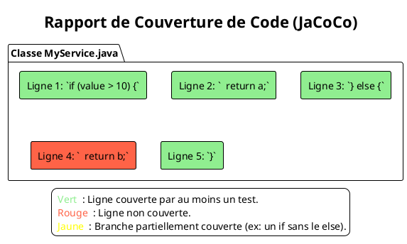

# Chapitre 11 : L'Art du Test : Bonnes Pratiques et Stratégies Avancées (L'essentiel)

### Objectifs pédagogiques

À la fin de cette partie, vous serez en mesure de :

- **Nommer** vos tests de manière claire et descriptive.
- **Organiser** vos classes et packages de test de façon logique.
- **Appliquer** le principe DRY (Don't Repeat Yourself) dans vos tests en utilisant des méthodes utilitaires.
- **Comprendre** le concept de "Test Data Builders" pour créer des objets de test complexes.
- **Expliquer** ce qu'est la couverture de code (Code Coverage) et comment interpréter cette métrique.

### Introduction : Devenir un artisan du code

Imaginez deux artisans menuisiers. Tous deux savent utiliser une scie et un marteau. Le premier laisse ses outils
partout, coupe ses planches de manière approximative et assemble ses meubles sans plan précis. Le second a un atelier
impeccable, chaque outil à sa place, des gabarits pour des coupes parfaites, et des plans détaillés. Lequel des deux
produira des meubles de qualité, durables et faciles à réparer ?

Être un bon développeur, c'est être comme le second artisan. Il ne suffit pas de savoir utiliser JUnit et Mockito. Il
faut savoir **organiser son travail, nommer ses outils et ses pièces, et suivre des plans éprouvés**.

Ce chapitre est consacré à l'organisation de votre "atelier de test". Nous allons voir comment des pratiques simples de
nommage, d'organisation et de factorisation peuvent transformer une suite de tests chaotique en une ressource claire,
maintenable et d'une valeur inestimable pour votre équipe.

### L'Importance d'un Nommage Clair

Le nom de votre méthode de test est la première chose que vous verrez quand un test échouera. Il doit être une phrase
complète et sans ambiguïté.

<tabs>
<tab title="Mauvaise Nomenclature ❌">
<p>Noms vagues, techniques, qui ne disent pas l'intention.</p>

```java
@Test
void test1() { ... }

@Test
void testGetUser() { ... }

@Test
void testError() { ... }
```

<p>Si <code>testError</code> échoue, quelle erreur ? Dans quelles conditions ? Vous devez lire tout le code pour comprendre.</p>
</tab>
<tab title="Bonne Nomenclature ✅">
<p>Une convention populaire est <b><code>methodName_shouldXXX_whenYYY</code></b>. Elle décrit l'action, le résultat attendu et le contexte.</p>

```java
@Test
void findById_shouldReturnUser_whenUserExists() { ... }

@Test
void findById_shouldReturnEmpty_whenUserDoesNotExist() { ... }

@Test
@DisplayName("Doit lancer une exception si le solde est insuffisant") // Encore mieux !
void withdraw_shouldThrowException_whenBalanceIsInsufficient() { ... }
```

<p>Le nom du test est auto-documenté. L'intention est limpide.</p>
</tab>
</tabs>

### Organiser Vos Tests

Une bonne organisation des packages de test facilite la navigation et la compréhension. La meilleure pratique est de *
*refléter la structure de vos packages de code source**.

```
src/
├── main/java/
│   └── fr/formation/spring/
│       ├── api/
│       │   └── BookController.java
│       └── service/
│           └── BookService.java
└── test/java/
    └── fr/formation/spring/
        ├── api/
        │   └── BookControllerTest.java
        └── service/
            └── BookServiceTest.java
```

Cette structure en miroir permet de trouver instantanément le test associé à une classe, et vice-versa.

### DRY (Don't Repeat Yourself) dans les Tests

La duplication de code est aussi néfaste dans les tests que dans le code de production. Si vous vous retrouvez à
copier-coller des blocs de code de configuration dans plusieurs tests, c'est un signal qu'il faut factoriser.

**Exemple de duplication :**

```java

@Test
void test1() {
    // 5 lignes pour créer un utilisateur complexe
    User user = new User();
    user.setFirstName("Alex");
    user.setLastName("Dev");
    user.setAddress(new Address("10 rue du Code", "Paris"));
    // ...
}

@Test
void test2() {
    // Les 5 mêmes lignes...
    User user = new User();
    user.setFirstName("Alex");
    user.setLastName("Dev");
    user.setAddress(new Address("10 rue du Code", "Paris"));
    // ...
}
```

**Solution simple : Une méthode utilitaire privée**

```java

@Test
void test1() {
    User user = createDefaultUser();
    // ...
}

@Test
void test2() {
    User user = createDefaultUser();
    // ...
}

private User createDefaultUser() {
    User user = new User();
    user.setFirstName("Alex");
    user.setLastName("Dev");
    user.setAddress(new Address("10 rue du Code", "Paris"));
    return user;
}
```

C'est simple, lisible et si la structure de `User` change, vous n'avez qu'un seul endroit à modifier.

### Le Pattern "Test Data Builder"

Pour la création d'objets de test complexes et variés, la méthode utilitaire a ses limites. Le pattern **Builder** est
une solution bien plus puissante et flexible. Il permet de créer des objets de test de manière fluide et lisible.

**Sans Builder :**

```java
// On ne voit pas ce qui est important pour ce test spécifique.
// C'est bruyant.
User user = new User(1L, "admin", "pwd123", "ADMIN", true, false);
```

**Avec un Builder :**

```java
public class UserBuilder {
    private String username = "defaultUser";
    private String role = "USER";

    public UserBuilder withUsername(String username) {
        this.username = username;
        return this;
    }

    public UserBuilder withRole(String role) {
        this.role = role;
        return this;
    }

    public UserBuilder asAdmin() {
        this.username = "admin";
        this.role = "ADMIN";
        return this;
    }

    public User build() {
        // ... logique de création de l'objet User
        return new User(username, role);
    }
}
```

**Utilisation dans le test :**

```java
// On voit immédiatement les données qui comptent pour ce test
User regularUser = new UserBuilder().build();

User specificUser = new UserBuilder()
        .withUsername("alex.dev")
        .build();

User admin = new UserBuilder().asAdmin().build();
```

Le test devient une description de l'intention, pas une cérémonie de `setters`.

### La Couverture de Code (Code Coverage)

La couverture de code est une métrique qui indique **quel pourcentage de votre code de production a été exécuté par vos
tests automatisés**. Un outil comme **JaCoCo** (Java Code Coverage) s'intègre à votre build (Maven, Gradle) et génère
des rapports visuels.



<warning>
**La couverture est un outil, pas un objectif.**
-   **Ce qu'elle fait bien :** Elle vous montre les zones de votre code qui ne sont **pas du tout testées**. C'est un excellent moyen de repérer des oublis.
-   **Son piège :** Un taux de couverture de 100% ne signifie pas que votre code est exempt de bugs. Cela signifie juste que chaque ligne a été exécutée. Vous pouvez avoir 100% de couverture avec des tests qui n'ont aucune assertion et qui ne valident rien.

**Règle d'or :** Ne visez pas un chiffre. Utilisez la couverture pour guider votre effort de test vers les zones d'ombre
de votre application. Un taux de 80-85% sur la logique métier complexe est souvent considéré comme un excellent
objectif.
</warning>

### Exercice 14 : Refactoriser un test avec un Builder

Vous avez plusieurs tests pour un `OrderService` qui manipulent des objets `Order` complexes. La création de ces objets
est répétitive.

**Le code de test répétitif :**

```java

@Test
void testShippedOrder() {
    Order order = new Order(UUID.randomUUID());
    order.setCustomer(new Customer("C01", "Alex"));
    order.setStatus(OrderStatus.SHIPPED);
    order.setShippingDate(Instant.now());
    order.setTotalPrice(new BigDecimal("150.00"));
    // ... test
}

@Test
void testPendingHighValueOrder() {
    Order order = new Order(UUID.randomUUID());
    order.setCustomer(new Customer("C02", "Sophie"));
    order.setStatus(OrderStatus.PENDING);
    order.setShippingDate(null);
    order.setTotalPrice(new BigDecimal("1200.00"));
    // ... test
}
```

**Votre mission :**

1. Créez une classe `OrderBuilder` dans votre répertoire de test.
2. Cette classe doit permettre de construire un `Order` avec des valeurs par défaut (par exemple, un statut `PENDING`,
   un prix de `10.00`).
3. Ajoutez des méthodes fluides comme `withStatus(OrderStatus status)`, `withTotalPrice(BigDecimal price)`.
4. Ajoutez une méthode de "raccourci" comme `shipped()` qui configure l'order avec un statut `SHIPPED` et une date
   d'expédition.
5. Refactorisez les deux tests ci-dessus pour utiliser votre nouveau `OrderBuilder`.

### Correction exercice 14 {collapsible="true"}

**1, 2, 3, 4. La classe `OrderBuilder` :**

```java
// Dans src/test/java/fr/formation/spring/builder/OrderBuilder.java
package fr.formation.spring.builder;

import fr.formation.spring.model.Order;
import fr.formation.spring.model.OrderStatus;

import java.math.BigDecimal;
import java.time.Instant;
import java.util.UUID;

public class OrderBuilder {
    private OrderStatus status = OrderStatus.PENDING;
    private BigDecimal totalPrice = new BigDecimal("10.00");
    private Instant shippingDate = null;

    public OrderBuilder withStatus(OrderStatus status) {
        this.status = status;
        return this;
    }

    public OrderBuilder withTotalPrice(BigDecimal price) {
        this.totalPrice = price;
        return this;
    }

    public OrderBuilder shipped() {
        this.status = OrderStatus.SHIPPED;
        this.shippingDate = Instant.now();
        return this;
    }

    public Order build() {
        Order order = new Order(UUID.randomUUID());
        order.setStatus(status);
        order.setTotalPrice(totalPrice);
        order.setShippingDate(shippingDate);
        // ... on pourrait aussi configurer un client par défaut
        return order;
    }
}
```

**5. Les tests refactorisés :**

```java

@Test
void testShippedOrder() {
    Order order = new OrderBuilder()
            .shipped()
            .withTotalPrice(new BigDecimal("150.00"))
            .build();
    // ... test
    assertThat(order.getStatus()).isEqualTo(OrderStatus.SHIPPED);
    assertThat(order.getShippingDate()).isNotNull();
}

@Test
void testPendingHighValueOrder() {
    Order order = new OrderBuilder()
            .withStatus(OrderStatus.PENDING) // Explicite, même si c'est le défaut
            .withTotalPrice(new BigDecimal("1200.00"))
            .build();
    // ... test
    assertThat(order.getStatus()).isEqualTo(OrderStatus.PENDING);
    assertThat(order.getTotalPrice()).isEqualByComparingTo("1200.00");
}
```

Les tests sont plus courts, plus lisibles et décrivent leur intention au lieu de se noyer dans les détails de la
création d'objets.

### Auto-évaluation

1. (Question ouverte) Expliquez la convention de nommage `method_should_when` et pourquoi elle est utile.
2. (QCM) Le pattern "Test Data Builder" est principalement utilisé pour :
    * a) Rendre les tests plus rapides.
    * b) Augmenter la couverture de code.
    * c) Simplifier la création d'objets de test complexes et améliorer la lisibilité des tests.
    * d) Remplacer Mockito.
3. (Question ouverte) Un rapport de couverture de code indique 95%. Qu'est-ce que cela signifie, et surtout, qu'est-ce
   que cela ne signifie pas ?
4. (QCM) Le principe DRY dans les tests signifie :
    * a) Dynamic Rollback Yields.
    * b) Don't Repeat Yourself - Éviter la duplication de code.
    * c) Data Repository Yields.
    * d) Drive, Reverse, Yield.
5. (QCM) La meilleure façon d'organiser ses packages de test est :
    * a) Mettre tous les tests dans un seul package.
    * b) Créer une structure de packages qui reflète celle du code source.
    * c) Créer des packages par type de test (unitaire, intégration...).
    * d) Laisser l'IDE choisir la structure.

*(Les corrections de l'auto-évaluation seront fournies à la toute fin du support de cours.)*

### Conclusion de la partie

Vous êtes désormais bien plus qu'un simple utilisateur d'outils de test. Vous êtes un artisan qui sait organiser son
atelier, nommer ses outils et utiliser des techniques avancées pour travailler proprement et efficacement. Vous savez
qu'un nommage clair, une bonne organisation, la factorisation du code via des méthodes utilitaires ou des **Builders**,
et une utilisation intelligente de la **couverture de code** sont les clés pour créer une suite de tests qui sera un
véritable atout pour votre projet.

Dans la partie "Pour aller plus loin" de ce chapitre, nous aborderons des stratégies encore plus avancées comme le TDD
et le BDD, et nous verrons comment intégrer nos tests dans un pipeline d'intégration continue. Vous êtes prêt pour les
concepts qui définissent le développement logiciel moderne de haute qualité.