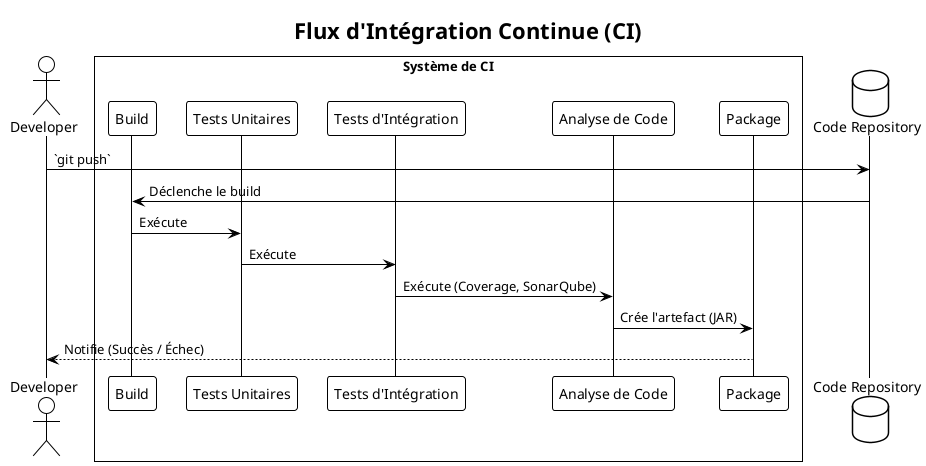

# Chapitre 11 : Stratégies de Qualité Supérieure et Automatisation (Pour aller plus loin)

### Objectifs pédagogiques

À la fin de cette partie, vous serez en mesure de :

- **Décrire** le cycle de développement du TDD (Test-Driven Development) et ses avantages.
- **Expliquer** comment le BDD (Behavior-Driven Development) favorise la collaboration au sein de l'équipe.
- **Structurer** vos tests en utilisant des classes de base pour éviter la duplication de configuration.
- **Comprendre** le rôle des tests automatisés dans un pipeline d'Intégration Continue (CI).
- **Identifier** le concept de tests de mutation et leur valeur ajoutée.

### Introduction : La construction de la cathédrale

Un artisan peut construire une magnifique chaise. Mais pour construire une cathédrale, il faut plus que des compétences
individuelles. Il faut un plan d'architecte, une méthode de construction, une collaboration parfaite entre les
différents corps de métier, et des vérifications constantes à chaque étape.

Dans cette partie, nous ne nous intéressons plus seulement à la construction de la "chaise" (une classe bien testée).
Nous nous intéressons à la construction de la "cathédrale" (l'application entière). Nous allons explorer des
méthodologies comme le TDD et le BDD, qui sont les plans d'architecte du développement logiciel. Nous verrons comment
organiser le chantier pour que tout le monde travaille efficacement (classes de base pour les tests) et comment mettre
en place des contrôles de qualité automatisés à chaque étape de la construction (Intégration Continue).

Préparez-vous à changer votre perspective : les tests ne sont plus quelque chose que vous *faites* à votre code, ils
deviennent le moteur même de sa conception et de son développement.

### TDD (Test-Driven Development) : Laisser les Tests Piloter

Nous avons déjà effleuré le TDD, mais il est temps de le formaliser. Le TDD n'est pas une technique de test, c'est une *
*technique de design et de développement**. Le principe est radical : **vous ne devez pas écrire une seule ligne de code
de production sans avoir d'abord un test automatisé qui échoue.**

Le cycle est un mantra simple : **Rouge - Vert - Refactor**.

<procedure title="Le Cycle TDD en Action">
    <step><b>1. Écrire un Test (ROUGE)</b></step>
    <p>Pensez à la plus petite fonctionnalité que vous voulez ajouter (ex: "un calculateur doit pouvoir additionner deux nombres"). Écrivez un test qui utilise cette fonctionnalité comme si elle existait déjà. Lancez le test : il doit échouer, soit parce que le code ne compile pas, soit parce que l'assertion est fausse. C'est l'étape <b>ROUGE</b>.</p>
    <code-block lang="java">
    @Test
    void shouldAddTwoNumbers() {
        Calculator calculator = new Calculator(); // La classe n'existe pas encore !
        int sum = calculator.add(2, 3); // La méthode n'existe pas !
        assertThat(sum).isEqualTo(5);
    }
    </code-block>

    <step><b>2. Écrire le Code Minimum (VERT)</b></step>
    <p>Écrivez le strict minimum de code nécessaire pour que le test passe au vert. Pas plus. Ne cherchez pas la perfection, cherchez juste à faire passer le test. C'est l'étape <b>VERTE</b>.</p>
    <code-block lang="java">
    public class Calculator {
        public int add(int a, int b) {
            return a + b; // Simple, direct.
        }
    }
    </code-block>
    <p>Lancez les tests : ils doivent tous passer.</p>
    
    <step><b>3. Refactoriser</b></step>
    <p>Maintenant que vous avez un filet de sécurité (le test vert), vous pouvez améliorer le code en toute confiance. Vous pouvez renommer des variables, extraire une méthode, améliorer l'algorithme... Tant que le test reste vert, vous savez que vous n'avez pas cassé la fonctionnalité. C'est l'étape de <b>REFACTOR</b>.</p>

</procedure>

**Avantages du TDD :**

- **Filet de sécurité :** Chaque morceau de code est né avec son test.
- **Aide à la conception :** Vous force à penser à l'utilisabilité de votre code avant de l'écrire. Si c'est difficile à
  tester, c'est probablement mal conçu.
- **Couverture de code naturelle :** Vous obtenez une couverture de code élevée "gratuitement".
- **Focus :** Vous vous concentrez sur une seule petite chose à la fois.

### BDD (Behavior-Driven Development) : La Conversation au Centre

Le BDD va un cran plus loin que le TDD. Il se demande : "Avant même d'écrire un test technique, sommes-nous sûrs que
nous avons tous compris le comportement attendu de la fonctionnalité ?". C'est un processus de **collaboration** qui
utilise un langage partagé pour s'assurer que les développeurs, les testeurs et les responsables produit sont sur la
même longueur d'onde.

Ce langage est souvent **Gherkin**, avec sa syntaxe `Given / When / Then` (Étant donné / Quand / Alors).

**Exemple Gherkin :**

```gherkin
Feature: Retrait d'argent au distributeur

  Scenario: Le compte est suffisamment approvisionné
    Given le solde du compte est de 100€
    When l'utilisateur demande 20€
    Then le distributeur doit délivrer 20€
    And le solde du compte doit être de 80€
```

Cet énoncé est la "source de vérité". Il est écrit **avant** le développement. Ensuite, les développeurs peuvent
l'implémenter, souvent en utilisant le TDD pour chaque étape. Des outils comme Cucumber peuvent même lier ces phrases en
langage naturel à du code de test Java, transformant vos spécifications en tests exécutables.

### DRY pour la Configuration : Les Classes de Base de Test

Dans les chapitres précédents, nous avons vu des configurations de test se répéter, comme celle pour Testcontainers.
C'est un cas parfait pour la factorisation en utilisant l'héritage.

**Le problème : Duplication de la configuration Testcontainers**

```java

@DataJpaTest
@Testcontainers
@AutoConfigureTestDatabase(replace = Replace.NONE)
class BookRepositoryTest {
    // ... déclaration du conteneur et @DynamicPropertySource
}

@DataJpaTest
@Testcontainers
@AutoConfigureTestDatabase(replace = Replace.NONE)
class AuthorRepositoryTest {
    // ... la MÊME déclaration de conteneur et @DynamicPropertySource
}
```

**La solution : Une classe de base abstraite**

```java
// Dans src/test/java/fr/formation/spring/config/PostgresIntegrationTest.java

@DataJpaTest
@Testcontainers
@AutoConfigureTestDatabase(replace = Replace.NONE)
public abstract class PostgresIntegrationTest {

    @Container
    static PostgreSQLContainer<?> postgres = new PostgreSQLContainer<>(
            "postgres:15-alpine"
    );

    @DynamicPropertySource
    static void configureProperties(DynamicPropertyRegistry registry) {
        registry.add("spring.datasource.url", postgres::getJdbcUrl);
        // ...
    }
}
```

**Les tests deviennent incroyablement plus propres :**

```java
class BookRepositoryTest extends PostgresIntegrationTest {
    @Autowired
    private BookRepository repository;
    // ... plus aucune configuration, juste les tests !
}

class AuthorRepositoryTest extends PostgresIntegrationTest {
    @Autowired
    private AuthorRepository repository;
    // ...
}
```

### L'Intégration Continue (CI) : Votre Gardien de la Qualité

L'intégration continue est la pratique qui consiste, pour les développeurs, à fusionner leur code dans un dépôt central
plusieurs fois par jour. Chaque fusion déclenche un **build automatisé** qui inclut l'exécution de **toute la suite de
tests**.

Des outils comme Jenkins, GitLab CI, ou GitHub Actions sont les moteurs de ce processus.



**Pourquoi c'est fondamental ?**

- **Détection rapide des régressions :** Si une modification casse quelque chose, l'équipe le sait en quelques minutes,
  pas en quelques semaines.
- **Confiance dans le build :** La branche principale est toujours considérée comme stable et "livrable".
- **Culture de la qualité :** Personne ne veut être celui qui "casse le build". Cela incite tout le monde à tester son
  code localement avant de le pousser.

### Aller plus loin : Les Tests de Mutation

Les tests de mutation sont une technique fascinante pour évaluer la **qualité de vos tests**. L'idée est la suivante : "
Et si un méchant gremlin modifiait mon code de production ? Est-ce que mes tests le détecteraient ?".

Un outil comme **Pitest** (PIT) va :

1. Exécuter tous vos tests. Ils doivent tous être verts.
2. Prendre votre code de production et y introduire de petites modifications (des "mutants"). Par exemple, il va changer
   un `if (a > b)` en `if (a >= b)`.
3. Relancer les tests pour chaque mutant.
4. Si un test échoue, le mutant est "tué". C'est une **bonne chose** ! Cela veut dire que votre test a détecté le
   changement.
5. Si tous les tests passent encore, le mutant a "survécu". C'est une **mauvaise chose**. Cela révèle une faiblesse dans
   votre suite de tests.

Les tests de mutation sont un excellent moyen de remettre en question vos assertions et de vous assurer que vos tests ne
sont pas juste des "tests de couverture" qui exécutent le code sans rien valider de pertinent.

### Exercice 15 : Réflexion stratégique

Vous êtes le leader technique d'une nouvelle équipe qui doit construire une API REST pour un système de e-commerce. Vous
devez présenter votre "stratégie de qualité" à l'équipe et au management.

**Votre mission :**
Rédigez un court plan en 3 à 5 points clés décrivant la stratégie de test que vous mettriez en place. Utilisez les
concepts vus dans ce chapitre (TDD/BDD, CI, types de tests, organisation...). Justifiez brièvement chaque point. Il ne
s'agit pas d'écrire du code, mais de définir une approche.

### Correction exercice 15 {collapsible="true"}

**Stratégie de Qualité pour le Projet E-commerce API**

Voici une proposition de stratégie qui combine plusieurs concepts pour une approche robuste.

1. **Fondation sur la Pyramide des Tests avec une Tendance "Trophy" :**
    * **Justification :** Nous allons construire une base solide de **tests unitaires** rapides pour toute notre logique
      métier (calculs de prix, gestion de stock), en utilisant une approche **TDD** pour garantir la qualité dès la
      conception. Cependant, comme notre API sera composée de nombreux flux intégrés (commande -> paiement -> stock),
      nous accorderons une grande importance aux **tests d'intégration** (`@WebMvcTest`, `@DataJpaTest`) pour valider la
      collaboration entre les composants. Ces tests offriront le meilleur retour sur investissement en termes de
      confiance.

2. **Collaboration via le BDD pour les Flux Critiques :**
    * **Justification :** Pour les fonctionnalités clés comme le "processus de paiement" ou la "création de compte",
      nous utiliserons une approche **BDD**. Avant toute implémentation, nous organiserons des ateliers avec les Product
      Owners pour écrire les scénarios en Gherkin (`Given/When/Then`). Cela garantira que nous construisons la bonne
      chose et ces scénarios serviront de base à nos tests d'intégration complets (`@SpringBootTest`).

3. **Intégration Continue (CI) comme Gardien de la Qualité :**
    * **Justification :** Chaque `push` sur notre dépôt Git déclenchera un pipeline de CI (via GitHub Actions). Ce
      pipeline compilera le code, exécutera **tous les tests** (unitaires et intégration), et analysera la **couverture
      de code** avec JaCoCo. Un build qui échoue ou une baisse significative de la couverture sur un module critique
      empêchera la fusion du code. La qualité est non-négociable et vérifiée en permanence.

4. **Environnements de Test Fiables avec Testcontainers :**
    * **Justification :** Pour éviter les mauvaises surprises, nos tests d'intégration de la couche de persistance ne s'
      exécuteront pas sur H2, mais sur des conteneurs Docker **Testcontainers** (ex: PostgreSQL, Redis). Cela garantit
      que nos tests tournent sur les mêmes technologies que la production, éliminant toute une classe de bugs liés à
      l'environnement.

5. **Organisation et Maintenabilité des Tests :**
    * **Justification :** Pour que notre suite de tests reste un atout, nous adopterons des conventions strictes :
      nommage clair (`should_when`), structure de package en miroir, et utilisation de **Test Data Builders** pour la
      création de données de test complexes (Commandes, Clients). Cela rendra les tests lisibles, maintenables et
      réduira la duplication de code.

### Auto-évaluation

1. (Question ouverte) Décrivez le cycle "Rouge-Vert-Refactor" du TDD.
2. (QCM) Lequel de ces énoncés décrit le mieux le BDD ?
    * a) Une technique pour écrire du code plus rapidement.
    * b) Une méthodologie de développement axée sur la collaboration et la définition partagée du comportement attendu.
    * c) Une bibliothèque pour tester le comportement des bases de données.
    * d) Une alternative à JUnit.
3. (Question ouverte) Quel est le principal avantage d'utiliser une classe de base de test abstraite pour des
   configurations de test récurrentes ?
4. (QCM) L'intégration continue (CI) a pour principal objectif de :
    * a) Remplacer les tests manuels.
    * b) Déployer automatiquement le code en production.
    * c) Détecter les problèmes d'intégration et les régressions le plus tôt possible en construisant et testant le code
      fréquemment.
    * d) Écrire les tests à la place des développeurs.
5. (QCM) Un "mutant qui survit" dans un test de mutation signifie que :
    * a) Le test est particulièrement robuste.
    * b) Le code de production est incassable.
    * c) La modification apportée au code n'a été détectée par aucun test, révélant une faiblesse dans la suite de
      tests.
    * d) L'outil de test de mutation a un bug.

*(Les corrections de l'auto-évaluation seront fournies à la toute fin du support de cours.)*

### Conclusion de la partie

Félicitations ! Vous avez atteint le sommet de la réflexion sur la qualité logicielle. Vous comprenez maintenant que les
tests ne sont pas une simple activité de vérification, mais une véritable philosophie qui peut guider l'architecture (
TDD), la collaboration (BDD) et les processus de toute une équipe (CI). Vous savez comment organiser votre travail pour
qu'il soit durable et comment utiliser des outils avancés pour évaluer la qualité de vos propres tests.

Vous êtes maintenant équipé non seulement pour écrire des tests, mais pour **construire une culture de la qualité**.
C'est une compétence inestimable qui vous distinguera en tant que Concepteur Développeur d'Application. Dans le dernier
chapitre, nous ferons une synthèse de notre voyage et nous vous donnerons des pistes pour continuer à apprendre et à
grandir.